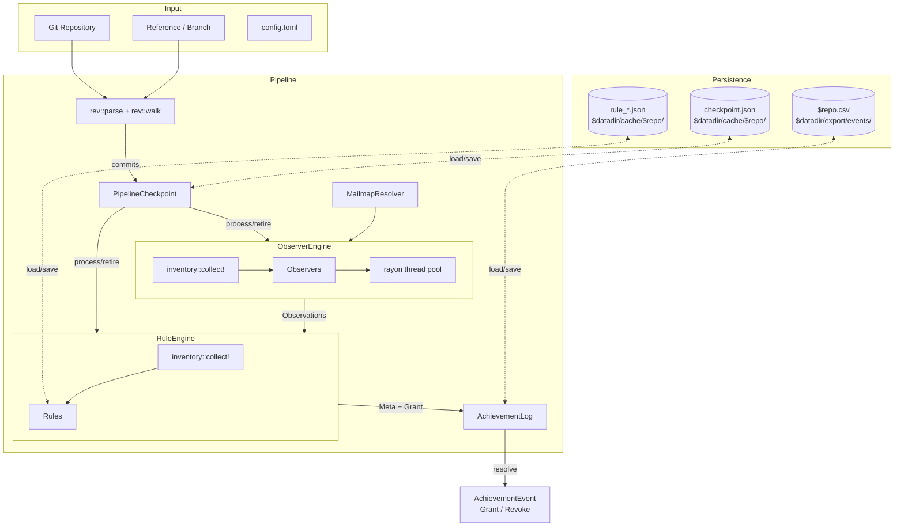

# Herostratus Architecture

## Project goals

This is a silly project to gamify things that shouldn't be gamified.

* The achievements should be whimsical and silly, and absolutely not be used in a serious manner
* It should be fast
* Its preferred UI is the CLI
* It should be easyish to set up by a new user
* It should be easyish to add new rules
* Its target runtime environment is modern Linux x86_64
* It should provide optional integrations to customize how achievements are presented to the user

Herostratus's target use-case is being run in a CI pipeline, either on a given project, or in a
pipeline downstream of multiple projects. The planned achievement integration is to generate a
static site suitable for hosting in GitHub / GitLab Pages.

There are design docs in [docs/design/](/docs/design) for various aspects of Herostratus's design.

## How is it used?

There's a stateless mode you can use for experimentation:

```sh
herostratus check path/to/repository
```

But the expected use-case is to track the same repository over time. As an example, the following
configures Herostratus to track itself and the Git repository.

```sh
herostratus add https://github.com/git/git.git
herostratus add git@github.com:Notgnoshi/herostratus.git
herostratus check-all
```

When you run `herostratus check-all` again sometime later, it will only reprocess commits newly
added since the previous run.

Configuration and state are tracked in the `~/.local/share/herostratus/` directory.

## Dataflow

Generally speaking, achievement `Grant`s are produced by `RulePlugin`s executed by the `RuleEngine`,
consuming `Observation`s generated by `Observer`s executed by the `ObserverEngine`. Once a `Grant`
is generated, the `AchievementLog` looks at past achievement events and the `AchievementKind` to
determine whether to emit an `AchievementEvent`.



## Types of achievements

There are four types of achievements:

* Per-user achievements
  * Recurrent / non-recurrent
* Global achievements
  * Revocable / non-revocable

This is defined by `Meta::kind`, and enforced by `AchievementLog::resolve()`.

## Testing

This project values testing. There are both unit and integration tests. The integration tests in
`herostratus/tests/` invoke the `herostratus` CLI binary and make assertions on its stdout/stderr
output.

All tests utilize the `TempRepository` test fixture provided by the `herostratus-tests` crate, and a
few tests utilize the <https://github.com/Notgnoshi/herostratus/branches/all?query=test> orphan
branches in the project.

## How to add a new achievement

* Consider how to build a test case. This can be done with a test branch, or the `TempRepository`
  test fixture.
* Build a new `Observer` that generates a new `Observation` enum variant. You may need to add
  multiple. The `Observer`s are where the majority of computation is performed. Don't forget the
  `inventory::submit!(ObserverFactory)` to register the `Observer` with the `ObserverEngine`
* Build a new `Rule` that consumes whatever necessary `Observation`s it needs.
  * Use `inventory::submit!(RuleFactory)` to register the new `RulePlugin` with the `RuleEngine`
  * You may need to define a `Rule::Cache` associated type to manage persistence between runs
  * You may need to add a new configuration struct to `Config`, and plumb it into the `RuleFactory`
    (see `H002Config` for an example)
* Add the new rule to the `RULES.md` and `CHANGELOG.md`

When a rule changes incompatibly between releases (cache shape, evaluation criteria, or `Meta`),
bump `Rule::VERSION`. This triggers selective cache and event invalidation for that rule on the next
run, without disturbing other rules' state. See
[docs/design/14-rule-cache-invalidation.md](docs/design/14-rule-cache-invalidation.md).
