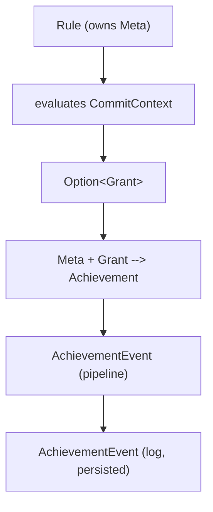

# Data model

# Status

**IMPLEMENTED**

# Scope

This document answers the following questions

* What data does an achievement contain or reference?
* What inputs does a rule require to grant an achievement?
* How do grants flow through the pipeline?

# Types

## Meta

Static metadata about an achievement. There is exactly one `Meta` per rule, defined at compile time.

| Field         | Type              | Description                                                     |
| ------------- | ----------------- | --------------------------------------------------------------- |
| `id`          | `usize`           | Numeric ID (e.g., 1 for H001)                                   |
| `human_id`    | `&'static str`    | Stable string identifier (e.g., `"fixup"`)                      |
| `name`        | `&'static str`    | Display name (e.g., `"Leftovers"`)                              |
| `description` | `&'static str`    | Short flavor text                                               |
| `kind`        | `AchievementKind` | Variation semantics -- how the engine enforces this achievement |

A `Meta` provides a convenience method `grant()` that constructs a `Grant` from a `CommitContext`.

## AchievementKind

How the engine enforces an achievement's variation semantics. See
[07-achievement-variations.md](07-achievement-variations.md) for the full design.

```rust
enum AchievementKind {
    /// Each user can hold independently.
    PerUser {
        /// false: at most once per user ("Have you ever done X?")
        /// true: multiple grants per user at rule-defined thresholds
        recurrent: bool,
    },

    /// One holder globally.
    Global {
        /// false: once granted, permanent ("First person to do X")
        /// true: new winner supersedes previous holder ("Best at X")
        revocable: bool,
    },
}
```

## Grant

What a rule returns to indicate "grant this achievement to this person." Contains only what the
engine needs to record the grant; the achievement identity comes from the rule's `Meta`.

The person who earns an achievement is not always the commit author -- they could be the committer
or some other role. The fields are named `user_name` / `user_email` to reflect this.

| Field                  | Type             | Description                                               |
| ---------------------- | ---------------- | --------------------------------------------------------- |
| `commit`               | `gix::ObjectId`  | The commit that triggered the grant                       |
| `user_name`            | `String`         | Name of the person earning the achievement                |
| `user_email`           | `String`         | Email of the person earning the achievement               |
| `name_override`        | `Option<String>` | When present, overrides `Meta.name` for this grant        |
| `description_override` | `Option<String>` | When present, overrides `Meta.description` for this grant |

Notice that a `Grant` allows for overriding the achievement name and description. This allows for
dynamic achievement titles, like "Novice Bug Author", "Legendary Bug Author" etc.

## Achievement

A fully resolved achievement, produced by combining a rule's `Meta` with a `Grant`. This is what the
pipeline passes downstream.

| Field           | Type            | Description                                                               |
| --------------- | --------------- | ------------------------------------------------------------------------- |
| `descriptor_id` | `usize`         | Numeric ID from `Meta`                                                    |
| `human_id`      | `&'static str`  | Stable string identifier from `Meta`                                      |
| `name`          | `String`        | Resolved display name (`Grant.name_override` or `Meta.name`)              |
| `description`   | `String`        | Resolved description (`Grant.description_override` or `Meta.description`) |
| `commit`        | `gix::ObjectId` | The commit that triggered the grant                                       |
| `user_name`     | `String`        | Mailmap-resolved user name                                                |
| `user_email`    | `String`        | Mailmap-resolved user email                                               |

## AchievementEvent (pipeline)

An achievement event emitted by the pipeline.

```rust
enum AchievementEvent {
    /// A new achievement was granted.
    Grant(Achievement),
    /// A previously granted achievement was revoked
    /// (for Global { revocable: true } achievements).
    Revoke(Achievement),
}
```

## AchievementEvent (log)

A timestamped record of a grant or revocation persisted in the achievement log (CSV).

| Field            | Type            | Description                         |
| ---------------- | --------------- | ----------------------------------- |
| `timestamp`      | `DateTime<Utc>` | When the event was recorded         |
| `event`          | `EventKind`     | `Grant` or `Revoke`                 |
| `achievement_id` | `String`        | The `human_id` of the achievement   |
| `commit`         | `gix::ObjectId` | The commit that triggered the event |
| `user_name`      | `String`        | Name of the person                  |
| `user_email`     | `String`        | Email of the person                 |

# Data flow



# References

* [07-achievement-variations.md](07-achievement-variations.md) -- AchievementKind design
* [09-mailmap.md](09-mailmap.md) -- mailmap resolution for user identity
* [12-observer-apis.md](12-observer-apis.md) -- rule and observer API specification
