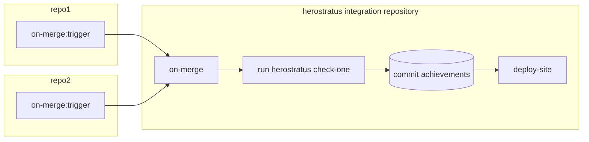

# Integrations

# GitLab

**REJECTED**: I don't want Herostratus to lose its sense of whimsy by being integrated into an
"official" achievements system. So I want it to feel like a fun side project, so I'm planning on
building a static web page instead.

GitLab provides an [Achievements API](https://docs.gitlab.com/ee/user/profile/achievements.html). It
appears it internally manages a database of achievements, and provides them their own ID when they
are created. So we'll have to maintain a mapping of our achievement IDs to the GitLab instance's
IDs.

This implies that there needs to be a stateful database that is GitLab (or in general) integration
specific.

It does not appear that you can link an achievement to the commit that generated it.

# Integration API

**DRAFT**: Regardless of what the integration is, I want there to be a well-defined API that enables
development of multiple integrations. I'm thinking a Rust trait that defines the interface, and a
Cargo feature for each integration that implements it. Then users would pick which integration(s)
they want via CLI arguments.

The API should include:

* What repository is being processed (maybe an instance of the integration object per-repository?
  but then what if there's a need for cross-repository state?)
* paths to the data directory, cache directory (for the repository), git directory, etc
* handle all cached achievement events from before the run
* handle the cached user database from before the run
* handle achievement events generated during the run
* handle the user database after the run
* handle statistics about the run

# Generate a static web page suitable for GitHub / GitLab pages sites

**DRAFT**: This is the integration I care about the most.

This leans into the idea of Herostratus's primary use-case being run in CI/CD pipelines. I had good
luck on another project hosting static JSON/CSV files and loading them from the SPA's JavaScript.

I think I probably don't want to generate the site directly from Herostratus, but rather generate
all the data the site needs to load, and have separate tooling for the site itself.

* Prefer vanilla JS to avoid npm / build tools / dependency hell, but maybe use a framework if it
  makes development easier?
* Allow injecting custom CSS similar to docs.rs
* Allow injecting custom HTML header/footer similar to docs.rs
* Landing page:
  * List of repositories
    * Link to page for each repository
      * More detailed timeline of achievement activity, each achievement links back to the user page
    * Recent activity for that repository
  * List of users
    * User page is a timeline of their achievement activity across all repositories
    * There's ways to get user profile pictures, use it.
  * List of achievements
    * Is this granted achievments? Sorted by number of users who have it? Is this all possible
      achievements?

Each achievement would need its own icon; perhaps take inspiration from Acha? I bet GenAI could do a
decent job of helping this unartistic fellow generate them.

The envisioned CI/CD deployment pipeline would look something like:

so I think the `check` subcommand needs a way to check just a single one of the repositories it's
configured to run on.

**NOTE:** The bare repository won't persist in the integration's Git repository, so it'll have to
re-clone it each time. But I think that's just how it's got to be if I run this from CI/CD
pipelines.

# Spit out achievements as JSON over stdout

**DRAFT**: This is the most basic integration that would be useful for integration tests

This could be an adapter integration that could be useful for integration tests, or for users to
build their own integrations against if they don't want to use the trait-and-feature API.
