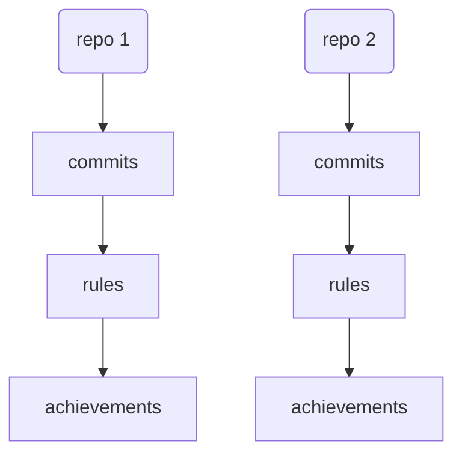
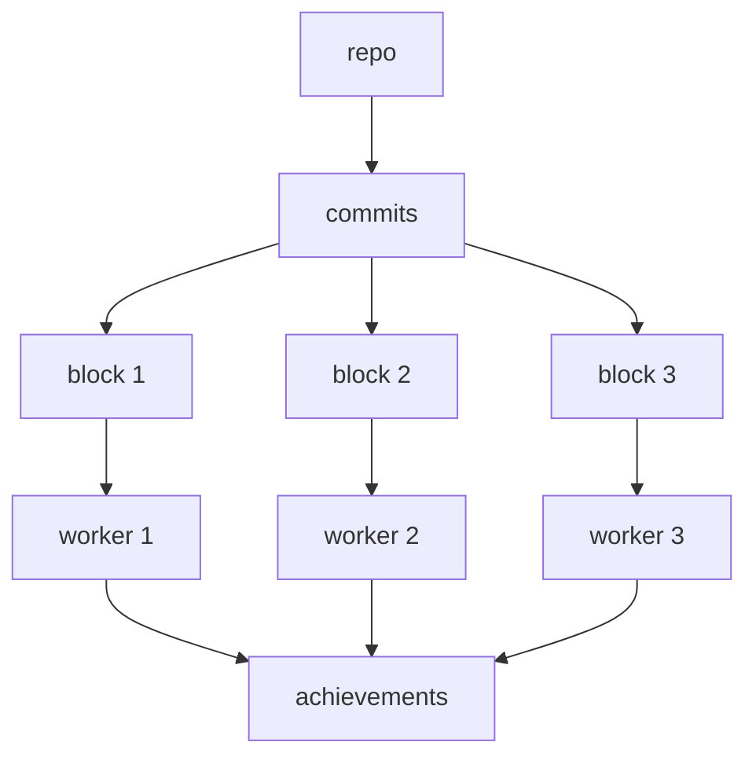
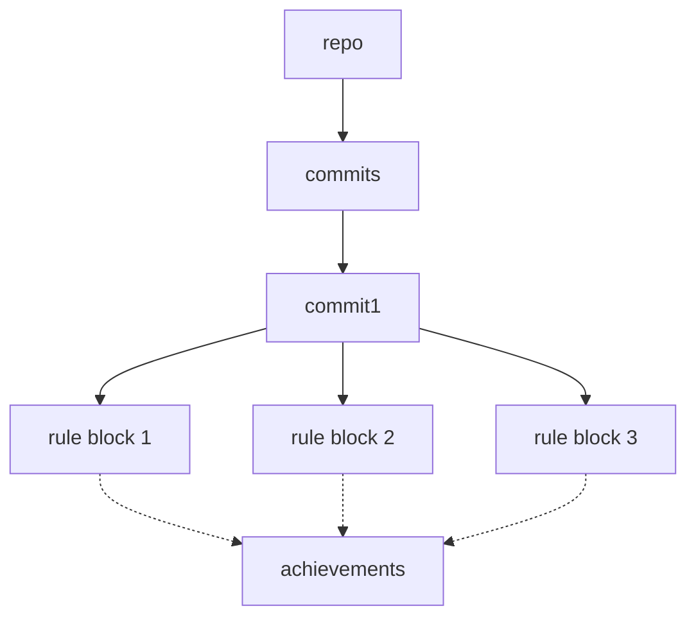

# Parallelism

# Status

**IMPLEMENTED**

# Goal

One of my complaints with <https://github.com/someteam/acha> is how slow and resource heavy it is.
And also that it's unmaintained and difficult to get running.

In _theory_ it shouldn't be expensive to process all of the commits on a given branch (typically the
repository's default branch), especially if there's a cache to prevent unnecessary re-processing.

This problem is embarassingly parallel though, so in addition to an efficient implementation,
parallelism should also be a good way to speed it up.

However, there are several approaches to parallelism, and the right choice depends on ???

# Constraints

* My expectation is that achievement processing is likely I/O constrained, and thus I'd want to
  spool up more tasks than cores.
* Running Herostratus in CI/CD triggered pipelines suggests that it won't be running on multiple
  repositories at once, so repository level parallelism is less important, in which case it's more
  important to process the rules in parallel for each commit.

# Questions

* Is it **necessary** to block advancing to the next commit until all rules have been processed for
  the current commit? If so, then the longest Rule will always be a bottleneck, and parallelism will
  only be useful up to a point.

# Approaches

## Repository level parallelism

Each repository is processed in serial, but multiple repositories can be processed at once.

**con:** The CLI tool I'm thinking of building would only process a single repository at once. The
parallelism would be limited to the consuming integration layer.

## Split the commits on the default branch into batches

**con:** Nondeterministic results if I care about which commit triggers an achievement. Although
maybe every achievement has levels, and it's okay to have multiple instances.

**con:** Requires loading all commits into memory, so that they can be chunked into blocks? Or is it
cheap enough to traverse the git graph that we can do that in parallel too?

## Process the commits serially, but the rules in parallel

* Rules might not be expensive enough to justify the parallelism overhead being stood up on each
  commit being processed.
* The number of rules is likely to increase over time
* Not all rules will have equal cost

# Proposal

I think I'll start by doing things in serial so see if processing the rules is too expensive (after
caching).
