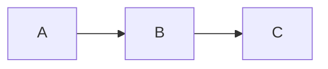

# Title

# Status

**PROPOSAL**

# Scope

What questions does this document answer? What problem does it address?

# Background

Context the reader needs to understand the problem. Link to related design documents where relevant,
e.g., [06-persistence.md](06-persistence.md).

# Proposal

The proposed design. Use subsections, diagrams, code snippets, and tables as needed.

## Sub-topic

# Alternatives considered

Other approaches that were evaluated and why they were rejected.

# Open questions

Unresolved decisions or areas that need further investigation.

# References

* Links to related design documents, issues, or external resources
