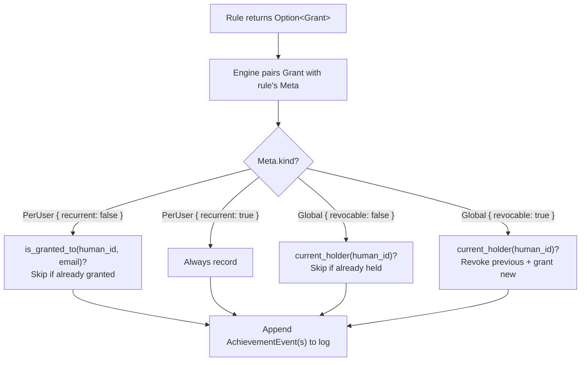

# Observer APIs

# Status

**IMPLEMENTED**

# Scope

This document contains the concrete API designs for the observer/rule split. It builds on decisions
made in the design roadmap (achievement variations, persistence, error handling). The module layout
in [observer-design.md](observer-design.md) maps these APIs to their file locations.

Each section corresponds to a design work item.

---

# 4a: Observation Enum

Observations are ephemeral, typed, per-commit facts emitted by observers and consumed by rules. The
enum is the contract between the two halves of the pipeline.

## Design decisions

**One enum, `#[non_exhaustive]`.** As decided in [observer-design.md](observer-design.md), a single
enum (rather than per-observer associated types) preserves exhaustiveness checking and avoids
`TypeId` downcasting through the `inventory` type-erasure boundary.

**Observers always emit when the fact is present.** Observers do not apply rule-specific thresholds.
For example, `SubjectLengthObserver` emits `SubjectLength` for every commit -- rules decide whether
the length is interesting. For signal-type observations (e.g., `Fixup`, `EmptyCommit`), the observer
emits only when the condition holds.

**Associated discriminant constants.** Observers and rules identify observation variants via
`Discriminant<Observation>` (for `emits()` and `consumes()`). Rather than requiring every call site
to construct a dummy value, the `Observation` enum provides associated constants:

```rust
impl Observation {
    pub const FIXUP: Discriminant<Self> = discriminant(&Observation::Fixup);
    pub const SUBJECT_LENGTH: Discriminant<Self> =
        discriminant(&Observation::SubjectLength { length: 0 });
    // ... one per variant
}
```

This keeps the `Default`-able fields constraint as an internal implementation detail of the enum
rather than something observer/rule authors need to think about. `std::mem::discriminant` is
`const fn` (stable since 1.75), so these are true compile-time constants with no runtime cost.
Data-carrying fields must implement `Default` (or have an obvious zero value) for the constant
definitions, but that's trivially satisfied -- observation payloads are small scalar types.

## Variant list

Five variants, matching the six existing rules (H002 and H003 share one observer):

```rust
#[non_exhaustive]
enum Observation {
    /// The commit subject line starts with a fixup/squash/amend/WIP/TODO/FIXME/DROPME prefix.
    /// Observer: FixupObserver (message-only)
    /// Rule: H001 Fixup
    Fixup,

    /// The length (in bytes) of the commit's subject line.
    /// Observer: SubjectLengthObserver (message-only)
    /// Rules: H002 Shortest Subject, H003 Longest Subject
    SubjectLength { length: usize },

    /// The raw commit message contains bytes that are not valid UTF-8.
    /// Observer: NonUnicodeObserver (message-only)
    /// Rule: H004 Non-Unicode
    NonUnicodeMessage,

    /// The commit introduces no file changes (empty tree diff). Merge commits are excluded
    /// by the observer (they have multiple parents and an empty diff is expected).
    /// Observer: EmptyCommitObserver (diff)
    /// Rule: H005 Empty Commit
    EmptyCommit,

    /// Every file change in the commit is a whitespace-only modification.
    /// Observer: WhitespaceOnlyObserver (diff)
    /// Rule: H006 Whitespace Only
    WhitespaceOnly,
}
```

## Observer-to-rule mapping

| Observer                 | Emits               | Consuming rules             |
| ------------------------ | ------------------- | --------------------------- |
| `FixupObserver`          | `Fixup`             | H001 Fixup                  |
| `SubjectLengthObserver`  | `SubjectLength`     | H002 Shortest, H003 Longest |
| `NonUnicodeObserver`     | `NonUnicodeMessage` | H004 Non-Unicode            |
| `EmptyCommitObserver`    | `EmptyCommit`       | H005 Empty Commit           |
| `WhitespaceOnlyObserver` | `WhitespaceOnly`    | H006 Whitespace Only        |

Five observers for six rules. One observer (`SubjectLengthObserver`) feeds two rules -- this is the
intended reuse benefit of the observer/rule split.

## Associated discriminant constants

The full set of constants for the initial variant list:

```rust
use std::mem::{Discriminant, discriminant};

impl Observation {
    pub const FIXUP: Discriminant<Self> = discriminant(&Observation::Fixup);
    pub const SUBJECT_LENGTH: Discriminant<Self> =
        discriminant(&Observation::SubjectLength { length: 0 });
    pub const NON_UNICODE_MESSAGE: Discriminant<Self> =
        discriminant(&Observation::NonUnicodeMessage);
    pub const EMPTY_COMMIT: Discriminant<Self> = discriminant(&Observation::EmptyCommit);
    pub const WHITESPACE_ONLY: Discriminant<Self> = discriminant(&Observation::WhitespaceOnly);
}
```

Observer and rule implementations reference these directly:

```rust
// Observer side
fn emits(&self) -> Discriminant<Observation> {
    Observation::SUBJECT_LENGTH
}

// Rule side
fn consumes(&self) -> &'static [Discriminant<Observation>] {
    &[Observation::SUBJECT_LENGTH]
}
```

Adding a future variant requires adding one constant to the `impl` block. The pattern scales
uniformly for unit variants (`Profanity`) and data-carrying variants
(`LineCount { added: 0, removed: 0 }`).

---

# 4b: CommitContext

`CommitContext` is the per-commit metadata that pairs with every observation flowing through the
channel. Rules see `CommitContext` + `Observation` -- they never touch the raw `gix::Commit`.

## Design decisions

**Minimum viable fields.** CommitContext carries only what rules need to construct a `Grant`:

```rust
struct CommitContext {
    pub oid: gix::ObjectId,
    pub author_name: String,
    pub author_email: String,
}
```

This matches the `Grant` struct (Phase 1) field-for-field. Rules construct grants via
`Meta::grant(ctx)` (see 4e, 4h), which hides the field-by-field construction.

**Fields considered and excluded:**

| Field                | Verdict  | Rationale                                                                                                                                                              |
| -------------------- | -------- | ---------------------------------------------------------------------------------------------------------------------------------------------------------------------- |
| committer name/email | Excluded | No current rule uses committer identity. Author is the relevant identity for achievements.                                                                             |
| timestamp            | Excluded | No current rule uses it. Easy to add later for time-based achievements ("commit at midnight").                                                                         |
| parent count         | Excluded | Used by EmptyCommit/WhitespaceOnly observers to skip merge commits, but observers have the raw commit. Rules don't need it.                                            |
| subject line         | Excluded | Used by FixupObserver and SubjectLengthObserver, but observers extract it from the raw commit. Rules receive the extracted fact via the observation, not the raw text. |

The struct is internal (not part of a public plugin API), so adding fields later is non-breaking.

**Mailmap resolution happens once, in the ObserverEngine.** The engine resolves the author identity
via mailmap before constructing `CommitContext`. All downstream consumers (observations, rules,
grants) see the canonical identity. This centralizes mailmap handling instead of scattering it
across rules.

**Ownership.** `CommitContext` owns its data (`String`, not `&str`) because it crosses a thread
boundary via the channel. It is sent once per commit via `CommitStart` (see 4g), not cloned per
observation.

## Lifecycle

```
ObserverEngine (per commit):
  1. Load commit from gix
  2. Resolve author via mailmap
  3. Construct CommitContext { oid, author_name, author_email }
  4. Send CommitStart(CommitContext) through channel
  5. Run observers (they receive the raw gix::Commit, not CommitContext)
  6. Send each emitted Observation through channel
  7. Send CommitComplete through channel
```

Observers never see `CommitContext` -- they work with the raw commit and return bare `Observation`
values. The context is sent once via `CommitStart`, not cloned per observation.

---

# 4c: Observer Trait

The `Observer` trait is the interface between the ObserverEngine and individual observation logic.
Observers receive raw commits (and optionally diffs) and emit `Observation` values.

## Design decisions

**One trait, not two.** The plan considered splitting message-only and diff observers into separate
traits. A single trait with default no-op diff methods is simpler: one `inventory` collection, one
engine dispatch path, and observers only override the methods they need. The
`is_interested_in_diff()` method tells the engine whether to compute diffs -- message-only observers
leave it as `false` and never see the diff lifecycle.

**`observe()` is always called.** For message-only observers, `observe()` is where they emit. For
diff observers, `observe()` provides access to commit metadata for per-commit setup (e.g., checking
parent count to skip merge commits) before the diff lifecycle runs. Diff observers typically return
`Ok(None)` from `observe()` and emit from `on_diff_end()`.

**Diff observers use transient per-commit state, not persistent cache.** Observers have no
`init_cache` / `fini_cache`. They are stateless across commits. But `&mut self` allows transient
state within a commit -- a diff observer can set flags in `observe()` and check them in the diff
lifecycle. `on_diff_start()` is the natural place to reset per-commit state.

**Per-commit diff bail-out via `DiffAction::Cancel`.** `is_interested_in_diff()` is a static
property of the observer (used at initialization for dependency tracking and diff skipping). A diff
observer that wants to skip the diff for a specific commit (e.g., merge commits) sets an internal
flag in `observe()` and returns `DiffAction::Cancel` from `on_diff_change()`. The overhead of
calling the lifecycle methods on a cancelled observer is negligible.

**All methods return `Result`.** Per Phase 3, the engine handles errors uniformly (log-and-skip).
Observers don't swallow errors from gix.

**Observers receive `&gix::Commit` and `&gix::Repository`.** Observers are internal to the engine
and tightly coupled to gix. The abstraction boundary is between observers and rules (via
`Observation`), not between the engine and observers. The repo reference is needed by diff observers
that load blob content (e.g., `WhitespaceOnlyObserver` compares file content before and after).

## Trait definition

```rust
trait Observer {
    /// The single observation variant this observer emits.
    fn emits(&self) -> Discriminant<Observation>;

    /// Whether this observer needs the computed diff. Default: false.
    /// Used by the engine to skip diff computation when no observer needs it.
    fn is_interested_in_diff(&self) -> bool { false }

    /// Called for every commit. Returns zero or one observations.
    ///
    /// For message-only observers, this is the sole emission point.
    /// For diff observers, this provides access to commit metadata before
    /// the diff lifecycle (e.g., to check parent count and set skip flags).
    fn observe(
        &mut self,
        commit: &gix::Commit,
        repo: &gix::Repository,
    ) -> eyre::Result<Option<Observation>>;

    /// Called once before diff hunks for a commit. Only called if is_interested_in_diff() is true.
    /// Use this to reset per-commit diff state.
    fn on_diff_start(&mut self) -> eyre::Result<()> { Ok(()) }

    /// Called for each file-level change in the diff.
    /// Return DiffAction::Cancel to stop receiving further changes for this commit.
    fn on_diff_change(
        &mut self,
        change: &gix::object::tree::diff::Change,
        repo: &gix::Repository,
    ) -> eyre::Result<DiffAction> {
        let _ = (change, repo);
        Ok(DiffAction::Cancel)
    }

    /// Called once after all diff changes (or after cancellation).
    /// Returns zero or one observations summarizing the diff.
    fn on_diff_end(&mut self) -> eyre::Result<Option<Observation>> { Ok(None) }
}

enum DiffAction {
    Continue,
    Cancel,
}
```

## Engine calling convention

```
For each commit:
  1. For ALL observers: call observe(commit, repo)
     → collect returned observations

  2. If any observer has is_interested_in_diff() == true:
     a. Compute diff (once, shared across all diff observers)
     b. For each diff observer: call on_diff_start()
     c. For each change in the diff:
        - For each active (non-cancelled) diff observer:
          call on_diff_change(change, repo)
        - Remove cancelled observers from the active set
        - If no active observers remain, stop iterating changes
     d. For each diff observer: call on_diff_end()
        → collect returned observations

  3. Send CommitStart(CommitContext) through channel
  4. Send each collected Observation through channel
  5. Send CommitComplete through channel
```

Step 2c mirrors the current early-out behavior in `engine.rs` -- once all diff observers have
cancelled, the engine stops computing further changes for that commit.

## Example: message-only observer

```rust
#[derive(Default)]
struct FixupObserver;

impl Observer for FixupObserver {
    fn emits(&self) -> Discriminant<Observation> { Observation::FIXUP }

    fn observe(
        &mut self,
        commit: &gix::Commit,
        _repo: &gix::Repository,
    ) -> eyre::Result<Option<Observation>> {
        let msg = commit.message()?;
        let title = msg.title.as_ref();
        let prefixes = ["fixup!", "squash!", "amend!", "WIP:", "TODO:", "FIXME:", "DROPME:"];
        let found = prefixes.iter().any(|p| title.starts_with(p));
        Ok(found.then_some(Observation::Fixup))
    }
}
```

Two methods. No diff lifecycle, no cache, no boilerplate.

## Example: diff observer

```rust
#[derive(Default)]
struct EmptyCommitObserver {
    // Transient per-commit state
    is_merge: bool,
    found_any_change: bool,
}

impl Observer for EmptyCommitObserver {
    fn emits(&self) -> Discriminant<Observation> { Observation::EMPTY_COMMIT }
    fn is_interested_in_diff(&self) -> bool { true }

    fn observe(
        &mut self,
        commit: &gix::Commit,
        _repo: &gix::Repository,
    ) -> eyre::Result<Option<Observation>> {
        self.is_merge = commit.parent_ids().count() > 1;
        Ok(None) // emission deferred to on_diff_end
    }

    fn on_diff_start(&mut self) -> eyre::Result<()> {
        self.found_any_change = false;
        Ok(())
    }

    fn on_diff_change(
        &mut self,
        _change: &gix::object::tree::diff::Change,
        _repo: &gix::Repository,
    ) -> eyre::Result<DiffAction> {
        if self.is_merge {
            return Ok(DiffAction::Cancel);
        }
        self.found_any_change = true;
        Ok(DiffAction::Cancel) // one change is enough to know it's not empty
    }

    fn on_diff_end(&mut self) -> eyre::Result<Option<Observation>> {
        if self.is_merge || self.found_any_change {
            return Ok(None);
        }
        Ok(Some(Observation::EmptyCommit))
    }
}
```

`observe()` checks parent count and sets a flag. The diff lifecycle uses that flag to cancel
immediately for merge commits. `on_diff_end()` emits only if no changes were found.

---

# 4d: ObserverFactory (no ObserverPlugin needed)

The existing `RulePlugin` trait exists to type-erase the `Rule::Cache` associated type, making
`Rule` object-safe behind `Box<dyn RulePlugin>`. Observers have no associated types -- the
`Observer` trait is already object-safe. `Box<dyn Observer>` works directly, so no `ObserverPlugin`
wrapper is needed.

The only infrastructure needed is a factory for `inventory` registration.

## ObserverFactory

```rust
pub struct ObserverFactory {
    factory: fn() -> Box<dyn Observer>,
}

impl ObserverFactory {
    pub const fn new<O: Observer + Default + 'static>() -> Self {
        fn create<O: Observer + Default + 'static>() -> Box<dyn Observer> {
            Box::new(O::default())
        }
        Self { factory: create::<O> }
    }

    pub fn build(&self) -> Box<dyn Observer> {
        (self.factory)()
    }
}

inventory::collect!(ObserverFactory);
```

## Registration

Observers register with a single `inventory::submit!` call:

```rust
inventory::submit!(ObserverFactory::new::<FixupObserver>());
inventory::submit!(ObserverFactory::new::<EmptyCommitObserver>());
```

## Why no config parameter?

`RuleFactory` takes `&RulesConfig` because some rules have user-configurable thresholds (e.g.,
H002/H003 subject length bounds). Observers don't have configuration -- they extract raw facts, and
thresholds live in rules. The factory takes no parameters. If a future observer needs configuration,
`ObserverFactory` can be extended to accept a config parameter following the same pattern as
`RuleFactory`.

---

# 4e: Rule Trait

The `Rule` trait is the interface between the RuleEngine and individual achievement-granting logic.
Rules receive observations (not raw commits) and return `Grant`s. The engine handles variation
enforcement (deduplication, revocation) using the `AchievementLog` (Phase 2).

## Changes from the current Rule trait

The new Rule trait is substantially simpler than the current one:

| Removed                        | Reason                                                     |
| ------------------------------ | ---------------------------------------------------------- |
| `process(&gix::Commit, &repo)` | Rules no longer see raw commits; they receive observations |
| `finalize(&gix::Repository)`   | No repo access needed; rules only see CommitContext        |
| Diff lifecycle methods         | Moved to Observer trait (4c)                               |
| `is_interested_in_diffs()`     | Moved to Observer trait (4c)                               |
| `descriptors() -> &[..]`       | Singular `meta()` -- one rule, one achievement             |
| `Vec<Achievement>` returns     | `Result<Option<Grant>>` -- Phase 1 + Phase 3               |

| Added                                  | Reason                                                          |
| -------------------------------------- | --------------------------------------------------------------- |
| `consumes()`                           | Checkpoint dependency tracking (which observers feed this rule) |
| `commit_start()` / `commit_complete()` | Per-commit lifecycle matching the channel protocol              |
| `Result` on all fallible methods       | Phase 3 error handling                                          |

| Unchanged                   |                           |
| --------------------------- | ------------------------- |
| `type Cache`                | Same pattern, same bounds |
| `init_cache` / `fini_cache` | Same semantics            |

## Trait definition

```rust
trait Rule {
    type Cache: Default + serde::Serialize + for<'de> serde::Deserialize<'de> + 'static;

    /// Static metadata about the achievement this rule grants.
    /// Meta includes AchievementKind (see 4h).
    fn meta(&self) -> &Meta;

    /// Which observation variants this rule consumes.
    /// Used by the checkpoint system for dependency tracking, not for runtime routing --
    /// every rule still receives every observation and ignores irrelevant variants.
    fn consumes(&self) -> &'static [Discriminant<Observation>];

    /// Called when a new commit begins. Use to reset per-commit state.
    fn commit_start(&mut self, _ctx: &CommitContext) -> eyre::Result<()> { Ok(()) }

    /// Process a single observation with its commit context. May return a Grant.
    fn process(
        &mut self,
        ctx: &CommitContext,
        obs: &Observation,
    ) -> eyre::Result<Option<Grant>>;

    /// Called when all observations for the current commit have been sent.
    /// Rules that buffer observations within a commit emit here.
    fn commit_complete(&mut self, _ctx: &CommitContext) -> eyre::Result<Option<Grant>> {
        Ok(None)
    }

    /// Called after all commits have been processed.
    /// Rules that accumulate state across commits (e.g., "shortest subject") emit here.
    fn finalize(&mut self) -> eyre::Result<Option<Grant>>;

    /// Initialize the rule with its persisted cache. Called once before any process() calls.
    fn init_cache(&mut self, _cache: Self::Cache) {}

    /// Return the cache for persistence. Called once after finalize().
    fn fini_cache(&self) -> Self::Cache { Self::Cache::default() }
}
```

## Design decisions

**No `name()` method.** The rule's stable identifier is `meta().human_id`, used for the checkpoint,
achievement log, and configuration. For logging, the `RulePlugin` blanket impl derives a name from
`std::any::type_name` (existing pattern).

**`consumes()` returns `&'static [Discriminant<Observation>]`.** The consumed observation set is
fixed per rule type, so a static slice avoids allocation. The associated constants from 4a are
`const`, so they can be promoted to `'static` temporaries: `&[Observation::SUBJECT_LENGTH]`.

**`meta()` returns `&Meta`.** One rule = one achievement, enforced structurally by the singular
return type. `Meta` includes `AchievementKind` (Phase 1) and a `grant(ctx)` convenience method that
constructs a `Grant` from a `CommitContext`. Full `Meta` design is in 4h.

**No repo access.** Rules never see `gix::Commit` or `gix::Repository`. They receive
`&CommitContext` (oid + mailmap-resolved author) and `&Observation` (the extracted fact). This is
the core decoupling of the observer/rule split.

**Per-commit lifecycle mirrors the channel protocol.** `commit_start()` / `process()` /
`commit_complete()` correspond to `ObserverData::CommitStart` / `Observation` / `CommitComplete`.
This gives rules explicit commit boundaries for buffering observations within a commit.
`commit_start()` and `commit_complete()` have default no-op implementations -- simple rules only
implement `process()`.

**`process()`, `commit_complete()`, and `finalize()` all return `Result<Option<Grant>>`.** Three
emission points at different granularities: per-observation, per-commit, and per-run. `Option::None`
means "no grant." The engine interprets grants according to the rule's `AchievementKind` (Phase 1):
deduplication for `PerUser`, revocation for `Global { revocable: true }`, etc. Rules don't know
about these semantics.

## Example: simple rule (no cache)

```rust
#[derive(Default)]
struct Fixup {
    meta: Meta,
}

impl Rule for Fixup {
    type Cache = ();

    fn meta(&self) -> &Meta { &self.meta }
    fn consumes(&self) -> &'static [Discriminant<Observation>] { &[Observation::FIXUP] }

    fn process(
        &mut self,
        ctx: &CommitContext,
        obs: &Observation,
    ) -> eyre::Result<Option<Grant>> {
        match obs {
            Observation::Fixup => Ok(Some(self.meta.grant(ctx))),
            _ => Ok(None),
        }
    }

    fn finalize(&mut self) -> eyre::Result<Option<Grant>> { Ok(None) }
}
```

Simple rules have a direct mapping: one observation in, one grant out. `Meta::grant(ctx)` constructs
the `Grant` from the commit context. The `_ => Ok(None)` arm handles irrelevant observations (every
rule receives every observation).

## Example: stateful rule (with cache)

```rust
#[derive(Default, Serialize, Deserialize, Clone)]
struct ShortestCache {
    shortest_length: Option<usize>,
}

struct ShortestSubject {
    meta: Meta,
    threshold: usize,
    cache: ShortestCache,
    candidate: Option<Grant>,
}

impl Rule for ShortestSubject {
    type Cache = ShortestCache;

    fn meta(&self) -> &Meta { &self.meta }
    fn consumes(&self) -> &'static [Discriminant<Observation>] { &[Observation::SUBJECT_LENGTH] }

    fn process(
        &mut self,
        ctx: &CommitContext,
        obs: &Observation,
    ) -> eyre::Result<Option<Grant>> {
        let Observation::SubjectLength { length } = obs else { return Ok(None) };

        let dominated_by_threshold = *length >= self.threshold;
        let dominated_by_cache = self.cache.shortest_length.is_some_and(|s| *length >= s);
        if dominated_by_threshold || dominated_by_cache {
            return Ok(None);
        }

        self.cache.shortest_length = Some(*length);
        self.candidate = Some(self.meta.grant(ctx));
        Ok(None) // deferred to finalize
    }

    fn finalize(&mut self) -> eyre::Result<Option<Grant>> {
        Ok(self.candidate.take())
    }

    fn init_cache(&mut self, cache: Self::Cache) { self.cache = cache; }
    fn fini_cache(&self) -> Self::Cache { self.cache.clone() }
}
```

`ShortestSubject` accumulates state across observations: it tracks the shortest length seen and
defers granting to `finalize()`. The cache persists the shortest length between runs. The engine
sees the `Global { revocable: true }` kind (from `meta()`) and handles revoking the previous holder
if the winner changes.

---

# 4f: RulePlugin Trait

`RulePlugin` type-erases the `Rule::Cache` associated type so rules can be stored as
`Box<dyn RulePlugin>`. The pattern is unchanged from the current codebase: a blanket
`impl<R: Rule> RulePlugin for R` converts `Cache` to/from `serde_json::Value` at the boundary.

## What changes

The new `RulePlugin` is simpler than the current one -- all diff-related methods are gone (moved to
Observer), and the return types change from `Vec<Achievement>` to `Result<Option<Grant>>`.

```rust
pub trait RulePlugin {
    // --- cache (type-erased) ---
    fn has_cache(&self) -> bool;
    fn init_cache(&mut self, cache: serde_json::Value) -> eyre::Result<()>;
    fn fini_cache(&self) -> eyre::Result<serde_json::Value>;

    // --- forwarded from Rule ---
    fn meta(&self) -> &Meta;
    fn consumes(&self) -> &'static [Discriminant<Observation>];
    fn commit_start(&mut self, ctx: &CommitContext) -> eyre::Result<()>;
    fn process(
        &mut self,
        ctx: &CommitContext,
        obs: &Observation,
    ) -> eyre::Result<Option<Grant>>;
    fn commit_complete(&mut self, ctx: &CommitContext) -> eyre::Result<Option<Grant>>;
    fn finalize(&mut self) -> eyre::Result<Option<Grant>>;
}
```

Compared to the current `RulePlugin`, the following are removed:

* `name()` -- the engine uses `meta().human_id` for identification and `type_name` for logging
* `is_interested_in_diffs()`, `on_diff_start()`, `on_diff_change()`, `on_diff_end()` -- moved to
  `Observer`
* `descriptors()` (plural) -- replaced by singular `meta()`

## Blanket implementation

```rust
impl<R: Rule> RulePlugin for R {
    fn has_cache(&self) -> bool {
        TypeId::of::<R::Cache>() != TypeId::of::<()>()
    }

    fn init_cache(&mut self, cache: serde_json::Value) -> eyre::Result<()> {
        let concrete = match cache {
            serde_json::Value::Null => R::Cache::default(),
            other => serde_json::from_value(other)?,
        };
        <R>::init_cache(self, concrete);
        Ok(())
    }

    fn fini_cache(&self) -> eyre::Result<serde_json::Value> {
        Ok(serde_json::to_value(<R>::fini_cache(self))?)
    }

    // Everything else forwards directly
    fn meta(&self) -> &Meta { <R>::meta(self) }
    fn consumes(&self) -> &'static [Discriminant<Observation>] { <R>::consumes(self) }
    fn commit_start(&mut self, ctx: &CommitContext) -> eyre::Result<()> {
        <R>::commit_start(self, ctx)
    }
    fn process(&mut self, ctx: &CommitContext, obs: &Observation) -> eyre::Result<Option<Grant>> {
        <R>::process(self, ctx, obs)
    }
    fn commit_complete(&mut self, ctx: &CommitContext) -> eyre::Result<Option<Grant>> {
        <R>::commit_complete(self, ctx)
    }
    fn finalize(&mut self) -> eyre::Result<Option<Grant>> {
        <R>::finalize(self)
    }
}
```

The cache methods are identical to today's implementation. The forwarding methods are simpler (fewer
parameters, no diff methods).

## RuleFactory

Unchanged from the current pattern. Rules that need configuration provide a custom factory; simple
rules use `RuleFactory::default`:

```rust
pub struct RuleFactory {
    factory: fn(&RulesConfig) -> Box<dyn RulePlugin>,
}

impl RuleFactory {
    pub const fn new(factory: fn(&RulesConfig) -> Box<dyn RulePlugin>) -> Self {
        Self { factory }
    }

    pub const fn default<R: RulePlugin + Default + 'static>() -> Self {
        Self { factory: |_| Box::new(R::default()) }
    }

    pub fn build(&self, config: &RulesConfig) -> Box<dyn RulePlugin> {
        (self.factory)(config)
    }
}

inventory::collect!(RuleFactory);
```

## Registration

```rust
// Simple rule (no config)
inventory::submit!(RuleFactory::default::<Fixup>());

// Rule with config
fn shortest_subject_factory(config: &RulesConfig) -> Box<dyn RulePlugin> {
    Box::new(ShortestSubject {
        threshold: config.h2_shortest_subject_line
            .as_ref()
            .map_or(10, |c| c.threshold),
        ..Default::default()
    })
}
inventory::submit!(RuleFactory::new(shortest_subject_factory));
```

---

# 4g: ObserverData

The channel connects the ObserverEngine (producer) and RuleEngine (consumer) across threads.

## Message type

```rust
enum ObserverData {
    /// Begins a new commit. Sent once before any observations for that commit.
    /// Carries the commit context (oid, mailmap-resolved author).
    CommitStart(CommitContext),

    /// A single observation extracted from the current commit.
    Observation(Observation),

    /// All observations for the current commit have been sent.
    /// Rules that buffer across observation types can flush here.
    CommitComplete,
}
```

No `ObservedCommit` wrapper is needed -- the commit context is sent once via `CommitStart` and the
RuleEngine tracks it as "current context." This eliminates per-observation `CommitContext` cloning.

## Design decisions

**Three variants.** `CommitStart` / `Observation` / `CommitComplete` bracket each commit's
observations. This gives the protocol a clear structure:

* **`CommitStart(CommitContext)`** -- sent once per commit, before any observations. The RuleEngine
  calls `rule.commit_start(ctx)` on all rules (for per-commit state reset), then stores the context
  for subsequent observations. Zero-observation commits are visible to rules through this signal.

* **`Observation(Observation)`** -- sent zero or more times per commit. Just the bare observation,
  no context wrapper.

* **`CommitComplete`** -- sent once per commit, after all observations. Always sent regardless of
  observer failures (Phase 3). The RuleEngine calls `rule.commit_complete(ctx)` on all rules --
  rules that buffer observations within a commit emit their grants here.

**No `RunComplete` or error signals.** The channel is `std::sync::mpsc`. When the ObserverEngine
finishes and drops the sender, `rx.recv()` returns `Err(RecvError)` -- that _is_ the run-complete
signal. Error signals are unnecessary because observer failures are log-and-skip at the
ObserverEngine level (Phase 3). The RuleEngine only sees successfully produced observations.

**No ordering guarantee within a commit.** Observations from different observers for the same commit
may arrive in any order. Rules must not assume ordering between observation types. They _can_ rely
on all observations for commit N arriving between its `CommitStart` and `CommitComplete`, and before
any messages from commit N+1.

## RuleEngine receive loop

```rust
let mut current_ctx: Option<CommitContext> = None;

while let Ok(msg) = rx.recv() {
    match msg {
        ObserverData::CommitStart(ctx) => {
            for rule in &mut rules {
                rule.commit_start(&ctx)?;
            }
            current_ctx = Some(ctx);
        }
        ObserverData::Observation(obs) => {
            let ctx = current_ctx.as_ref().expect("Observation before CommitStart");
            for rule in &mut rules {
                rule.process(ctx, &obs)?;
            }
        }
        ObserverData::CommitComplete => {
            let ctx = current_ctx.as_ref().expect("CommitComplete before CommitStart");
            for rule in &mut rules {
                rule.commit_complete(ctx)?;
            }
        }
    }
}
// Channel closed: ObserverEngine is done. Call finalize() on all rules.
for rule in &mut rules {
    rule.finalize()?;
}
```

---

# 4h: Meta, Grant, and Achievement

This section defines the achievement-related types and how they relate. There are four types at
different stages of the pipeline:

```
Meta (static)          -- describes what an achievement is
Grant (per-event)      -- what a rule returns: "grant this to commit X's author"
AchievementEvent (log) -- timestamped record of a grant or revocation
AchievementKind (static) -- variation semantics (Phase 1)
```

## Meta

Renamed from `AchievementDescriptor`. Lives in the `achievements` module (accessed as
`achievements::Meta`). Bundles the static metadata about an achievement with a convenience method
for constructing grants.

```rust
/// Static metadata about an achievement. One per rule.
pub struct Meta {
    /// Numeric ID (e.g., 1 for H001).
    pub id: usize,

    /// Stable string identifier (e.g., "fixup", "shortest-subject-line").
    /// Used in the achievement log, checkpoint, and configuration.
    pub human_id: &'static str,

    /// Display name (e.g., "Leftovers").
    pub name: &'static str,

    /// Short flavor text (e.g., "Leave a fixup! commit in your history").
    pub description: &'static str,

    /// Variation semantics -- how the engine enforces this achievement.
    pub kind: AchievementKind,
}
```

### Meta::grant()

```rust
impl Meta {
    /// Construct a Grant from a CommitContext.
    /// Hides the field-by-field construction so rules just write
    /// `self.meta.grant(ctx)`.
    pub fn grant(&self, ctx: &CommitContext) -> Grant {
        Grant {
            commit: ctx.oid,
            author_name: ctx.author_name.clone(),
            author_email: ctx.author_email.clone(),
        }
    }
}
```

### Meta::id_matches()

```rust
impl Meta {
    /// Check if a user-provided string matches this achievement.
    /// Accepts: "1", "H1", "fixup", "H1-fixup".
    pub fn id_matches(&self, id: &str) -> bool {
        id == self.id.to_string()
            || id == format!("H{}", self.id)
            || id == self.human_id
            || id == format!("H{}-{}", self.id, self.human_id)
    }
}
```

Carried forward from the current `AchievementDescriptor`. Used by configuration to enable/disable
rules by any of their ID forms.

## AchievementKind

Finalized in Phase 1. Included here for completeness:

```rust
enum AchievementKind {
    /// Each user can hold independently.
    PerUser {
        /// false: at most once per user ("Have you ever done X?")
        /// true: multiple grants per user at rule-defined thresholds
        recurrent: bool,
    },

    /// One holder globally.
    Global {
        /// false: once granted, permanent ("First person to do X")
        /// true: new winner supersedes previous holder ("Best at X")
        revocable: bool,
    },
}
```

## Grant

What rules return from `process()` and `finalize()`. Contains only what the engine needs to record
the grant -- the achievement identity comes from the rule's `Meta`.

```rust
struct Grant {
    pub commit: gix::ObjectId,
    pub author_name: String,
    pub author_email: String,
}
```

`Grant` is deliberately minimal. It does not carry the achievement ID, kind, or timestamp -- those
are added by the engine when creating an `AchievementEvent`. This keeps rules simple: they just say
"this commit's author deserves a grant."

## AchievementEvent

What gets stored in the `AchievementLog` (Phase 2). Created by the engine, not by rules.

```rust
struct AchievementEvent {
    pub timestamp: DateTime<Utc>,
    pub event: EventKind,
    pub achievement_id: String,
    pub commit: gix::ObjectId,
    pub author_name: String,
    pub author_email: String,
}

enum EventKind {
    Grant,
    Revoke,
}
```

Maps directly to the CSV schema from Phase 2:

```
timestamp,event,achievement_id,commit,author_name,author_email
```

The `achievement_id` is `Meta::human_id` (not the numeric ID) -- more readable and stable across
renumbering. `AchievementKind` is not stored; it's a property of the rule definition, known at
runtime.

For revoke events, `commit`/`author_name`/`author_email` identify which grant is being revoked, not
what triggered the revocation.

## How the types flow through the pipeline



## No separate Achievement type

The current codebase has an `Achievement` struct used for output. In the new model, this is replaced
by the combination of `Meta` + `AchievementEvent`. The display layer iterates
`AchievementLog::active_grants()` and joins each event with the corresponding rule's `Meta` for
rendering. No dedicated output type is needed.

---

# 4i: AchievementLog

The `AchievementLog` is the in-memory representation of the achievement CSV file. It is the sole
interface for the engine's variation enforcement (the flow diagram in 4h). Rules do not access it
directly.

## Design decisions

**Simple in-memory representation.** The achievement count is small (tens to hundreds of events), so
a `Vec<AchievementEvent>` with linear scans is fine. Internal indexing can be added later without
changing the API.

**Query methods derived from variation enforcement.** The three query methods (`is_granted_to`,
`current_holder`, `active_grants`) correspond directly to the four `AchievementKind` branches in the
flow diagram:

| AchievementKind                | Query used                 |
| ------------------------------ | -------------------------- |
| `PerUser { recurrent: false }` | `is_granted_to(id, email)` |
| `PerUser { recurrent: true }`  | (none -- always record)    |
| `Global { revocable: false }`  | `current_holder(id)`       |
| `Global { revocable: true }`   | `current_holder(id)`       |

`active_grants()` is used by meta-achievements and the display layer, not by variation enforcement.

**Deterministic output ordering.** When the engine produces multiple new events within a single
commit boundary (e.g., one commit triggers two different achievements), the events are sorted by
`achievement_id` before appending to the log. This eliminates non-determinism from parallel observer
scheduling and ensures stable output when the CSV is stored in git.

## Struct definition

```rust
struct AchievementLog {
    path: PathBuf,
    events: Vec<AchievementEvent>,
}

impl AchievementLog {
    /// Load from the CSV file. Returns an empty log if the file does not exist.
    fn load(path: &Path) -> eyre::Result<Self>;

    /// Write the full log to the CSV file.
    fn save(&self) -> eyre::Result<()>;

    /// Has this achievement been granted to this user?
    /// Used by the engine for PerUser { recurrent: false } deduplication.
    fn is_granted_to(&self, achievement_id: &str, author_email: &str) -> bool;

    /// Who currently holds this global achievement?
    /// Returns the most recent non-revoked grant, or None.
    /// Used by the engine for Global { .. } uniqueness and revocation.
    fn current_holder(&self, achievement_id: &str) -> Option<&AchievementEvent>;

    /// All currently active (non-revoked) grants.
    /// Used by meta-achievements and the display layer.
    fn active_grants(&self) -> impl Iterator<Item = &AchievementEvent>;

    /// Append a grant event to the log.
    fn record_grant(&mut self, event: AchievementEvent);

    /// Mark the current grant for this achievement+author as revoked.
    /// Appends a revoke event (does not delete the original grant).
    fn record_revocation(&mut self, achievement_id: &str, author_email: &str);
}
```

## CSV round-trip

`load` parses the CSV file into `Vec<AchievementEvent>`. `save` writes the full vector back. During
a run, the engine loads the log at startup, mutates it in memory via `record_grant` and
`record_revocation`, and saves it at the end alongside the checkpoint.

The log is append-only in the common case (incremental runs add events, never modify existing ones).
`save` writes the full vector rather than appending to handle the edge case of a corrupted or
truncated file -- the log is small enough that a full rewrite is acceptable.

---

# References

* [observer-design.md](observer-design.md) -- the architectural design
* [observer-architecture.md](observer-architecture.md) -- the original proposal
* [achievement-variations.md](achievement-variations.md) -- achievement variation taxonomy
* [persistence.md](persistence.md) -- data storage design
