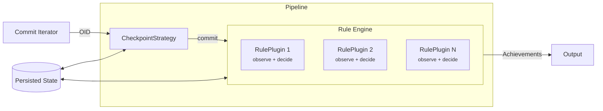
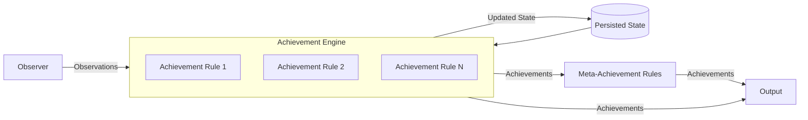

# Observer Architecture

# Status

**ARCHITECTURAL PROPOSAL**

This document describes the high-level architecture of the observer/rule split. For detailed
software design (types, interfaces, data flow, parallelism, checkpoint integration), see
[observer-design.md](observer-design.md). For concrete API designs, see
[observer-apis.md](observer-apis.md).

# Motivation

The current pipeline architecture:

There is tension in the current `Rule` trait between two responsibilities:

1. **Observing** commits -- scanning messages, computing diffs, extracting facts
2. **Deciding** achievements -- aggregating state, handling uniqueness/recurrence, granting

Today, a `Rule` does both. For simple stateless achievements (H001 fixup, H004 non-unicode), this
works fine. But it breaks down for:

* **Recurring achievements** like "swore 7 times" -- the Rule needs per-author aggregation state
  that's conceptually separate from the observation "this commit contains profanity."
* **Shared observations** -- if "swore 7 times", "most prolific swearer", and "first person to
  swear" all need profanity detection, the current model either crams all three into one Rule
  (growing complexity) or duplicates the scanning work across three Rules.
* **Unique/revocable achievements** -- the logic for "only one holder at a time" is tangled with the
  observation logic.
* **Meta-achievements** like "most achievements overall" -- these have no commit to visit and
  fundamentally can't be expressed as a `Rule` today.

This tension has made the [achievement-variations.md](achievement-variations.md) design more
challenging, as there's not obviously correct mechanisms within the current model for handling these
cases.

# Proposal

Split the current `Rule` into two components:

## Observers

Observers visit commits and emit typed, per-commit observations. They are stateless -- their job is
to extract facts from commits, not to decide what those facts mean. Observers may use `&mut self`
for transient per-commit state (e.g., tracking whether a merge commit should be skipped), but they
have no persisted cache.

Examples:

* `SubjectLengthObserver` emits `SubjectLength { length }` for each commit
* `ProfanityObserver` emits `Profanity` for commits with profanity
* `EmptyCommitObserver` emits `EmptyCommit` for commits with no file changes

Computation sharing (diffs) stays at the commit walker level, same as today's
`is_interested_in_diffs` / `on_diff_change` pattern. Observers don't share state with each other.

## Observations

Observations are **ephemeral**. They are typed, per-observer facts about commits. They are not
persisted. Persistence is the responsibility of achievement rules, similar to the existing
`RuleCache`s.

A single `#[non_exhaustive]` `Observation` enum wraps all possible observation types. Commit
metadata (oid, author) is not part of the observation -- a separate `CommitContext` struct carries
this information through the channel.

An associated-type alternative (each observer defines its own observation type) was considered and
rejected. The `inventory` plugin system type-erases observers, which would also erase the associated
observation type. Recovering it on the rule side would require `TypeId` + downcasting -- less
ergonomic and less safe than enum variant matching, without the exhaustiveness checking that the
compiler provides for enums.

## Achievement variations

The architecture supports four kinds of achievements along two axes (scope and
cardinality/revocability):

* **PerUser (one-time)** -- at most once per user ("Have you ever done X?")
* **PerUser (recurrent)** -- multiple grants per user at rule-defined thresholds ("Swore N times")
* **Global (irrevocable)** -- one holder globally, permanent ("First person to do X")
* **Global (revocable)** -- one holder globally, new winner supersedes ("Best at X")

Rules declare their `AchievementKind` and return `Option<Grant>` expressing who deserves the
achievement. The engine enforces variation semantics (per-user deduplication, global uniqueness,
revocation) using the achievement log. Rules don't know about revocation or deduplication.

## Achievement rules

Achievement rules consume observations and decide whether to grant achievements. They own their
aggregation logic and persisted state. Rules do not access the raw `gix::Commit` -- they receive
`CommitContext` + `Observation` only.

There is a one-to-one relationship between rules and the achievements they can generate. This does
away with the `AchievementDescriptor` system, replacing it with a singular `Meta` per rule.

Rules do not declare interest in specific observation variants for routing purposes. Every rule
receives every observation and ignores irrelevant variants via a catch-all match arm. A `consumes()`
method exists for the checkpoint system's dependency tracking, not for runtime routing.

## Meta-achievement rules

Meta-achievements (e.g., "most achievements overall") are a post-processing phase that consumes the
full achievement log after the regular rule engine finishes. They are not a separate engine -- they
are a finalization step within the orchestration layer.

Meta-achievements do not use the `Rule` trait (they consume achievements, not observations) and do
not cascade (no meta-achievement triggers another). The post-processing phase is a single pass. Each
meta-achievement is a simple struct with a `Meta` and an evaluation function -- no formal trait, no
`inventory` registration.

Meta-achievements are recomputed from scratch each run. They always evaluate the full achievement
log. The engine's existing `AchievementKind` enforcement handles deduplication and revocation: if
the holder hasn't changed, no log entry is written.

## Incremental processing

The checkpoint system tracks which commits have been processed and by which observers/rules. Only
new commits are visited, and if new rules are added, they run over all commits.

The observer-to-rule dependency graph is computed at initialization by matching each observer's
`emits()` discriminant against rules' `consumes()` discriminants. Only the observers necessary to
feed the new rules re-run. The dependency graph is not persisted -- it is recomputed from
`emits()`/`consumes()` on each run.

## Achievement persistence

Achievements are persisted in an append-only CSV log. The engine is the sole writer of the log;
rules do not access it directly. The log records both grant and revoke events, enabling the engine
to enforce variation semantics (deduplication, uniqueness, revocation) across incremental runs.

The achievement log and checkpoint are a paired unit of cached state. If either is missing or
inconsistent, both are deleted and the repository is reprocessed from scratch.

## Error handling

All observer and rule methods return `eyre::Result`. The engines apply a log-and-skip policy for
observer/rule failures: a single malformed commit should not prevent processing the rest of the
repository. Infrastructure failures (can't open repo, can't load checkpoint) abort the run.

On observer failure, only the failing observer is skipped for that commit. Other observers still
process the commit normally, and the failing observer runs again on the next commit.

## Plugin registration

Two separate `inventory` collections, one for observers and one for rules. The `Observer` trait is
already object-safe (`Box<dyn Observer>` works directly), so no `ObserverPlugin` wrapper is needed
-- only an `ObserverFactory` for `inventory` registration. Rules continue to use the `RulePlugin`
type-erasure pattern for the `Rule::Cache` associated type.

## Migration path

Clean break. Implement the new model bottom-up, migrate all six existing rules at once, then delete
the old code. The small number of existing rules makes this feasible without an adapter layer.

During implementation, old infrastructure files are renamed with `_old` suffixes while new files
take the canonical paths. Observer and rule implementations live in `impls/` subdirectories,
avoiding path conflicts with old files. Both old and new code coexist and compile until the final
cleanup commit deletes all `_old` files and switches the binary to the new pipeline.

See [observer-design.md](observer-design.md) for the full module layout, coexistence strategy, and
step-by-step migration order.

# Impact on existing rules

| Current Rule          | Observer               | Observation         | Achievement Rule          | AchievementKind                |
| --------------------- | ---------------------- | ------------------- | ------------------------- | ------------------------------ |
| H001 Fixup            | FixupObserver          | `Fixup`             | Simple grant              | `PerUser { recurrent: false }` |
| H002 Shortest subject | SubjectLengthObserver  | `SubjectLength`     | Stateful (tracks minimum) | `Global { revocable: true }`   |
| H003 Longest subject  | SubjectLengthObserver  | `SubjectLength`     | Stateful (tracks maximum) | `Global { revocable: true }`   |
| H004 Non-Unicode      | NonUnicodeObserver     | `NonUnicodeMessage` | Simple grant              | `PerUser { recurrent: false }` |
| H005 Empty commit     | EmptyCommitObserver    | `EmptyCommit`       | Simple grant              | `PerUser { recurrent: false }` |
| H006 Whitespace only  | WhitespaceOnlyObserver | `WhitespaceOnly`    | Simple grant              | `PerUser { recurrent: false }` |

H002 and H003 demonstrate the reuse benefit: one observer feeds two achievement rules, where today
the single `SubjectLineLength` Rule handles both internally.

For simple rules (H001, H004, H005, H006), the split adds a small amount of boilerplate -- the
observer and achievement rule are nearly trivial individually.

# Resolved questions

These were originally open questions in the initial proposal. They have been resolved during the
detailed design work.

1. **How do achievement rules declare which observation types they consume?** No runtime routing.
   Every rule receives every observation and ignores irrelevant variants. Rules declare `consumes()`
   returning `&'static [Discriminant<Observation>]` for checkpoint dependency tracking only.

2. **Migration path.** Clean break with `_old` coexistence. All six existing rules are migrated at
   once. No adapter layer. See [observer-design.md](observer-design.md) for the full module layout
   and migration strategy.

3. **How does this impact the `RulePlugin` type erasure pattern?** Two separate `inventory`
   collections (`ObserverFactory` and `RuleFactory`). Observers are object-safe and don't need a
   plugin wrapper. Rules continue to use `RulePlugin` for cache type-erasure. See
   [observer-apis.md](observer-apis.md) sections 4d and 4f.

4. **Observer statefulness.** Observers are stateless across commits. No `init_cache`/`fini_cache`.
   `&mut self` allows transient per-commit state (e.g., flags set in `observe()` and checked in the
   diff lifecycle), reset via `on_diff_start()`.

5. **Achievement persistence.** Append-only CSV log. Engine-only access. Schema:
   `timestamp,event,achievement_id,commit,author_name,author_email`. Paired with checkpoint data.
   See [observer-design.md](observer-design.md) for persistence integration details.

6. **Incremental processing details.** Dependency graph computed from `emits()`/`consumes()` at
   initialization. Not persisted. Checkpoint tracks which observer and rule IDs have processed which
   commits.

7. **Do meta-achievements cascade? What happens to meta-achievements if a unique achievement is
   revoked?** No cascading -- single pass. Revocation is handled by recomputing meta-achievements
   from scratch each run. The engine's `AchievementKind` enforcement deduplicates and revokes as
   needed. Meta-achievements use a simple struct with a function pointer, not the `Rule` trait.

8. **Does this refactor go hand-in-hand with adding achievement variations?** Yes. Achievement
   variations (`AchievementKind`) are designed as part of this architecture. The variation model has
   been validated against concrete test cases:
   * Swore N times -- `PerUser { recurrent: true }`
   * First person to swear -- `Global { revocable: false }`
   * Most achievements -- meta-achievement, `Global { revocable: true }`, recomputed each run

# References

* [observer-design.md](observer-design.md) -- detailed software design (types, interfaces, data
  flow, parallelism, checkpoint integration)
* [observer-apis.md](observer-apis.md) -- concrete API designs for Observer, Rule, plugins, and
  channel protocol
* [achievement-variations.md](achievement-variations.md) -- achievement variation taxonomy
* [persistence.md](persistence.md) -- data storage design
* [parallelism.md](parallelism.md) -- parallelism strategies
