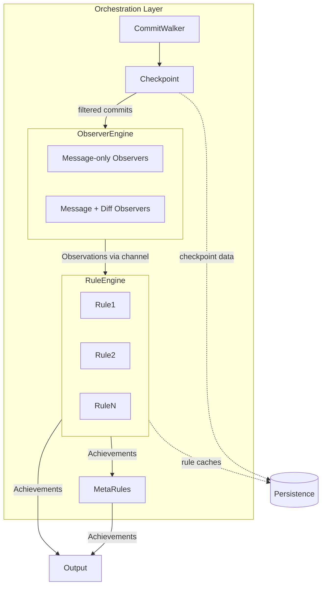

# Observer Design

# Status

**IMPLEMENTED**

# Scope

This document drills into the software design of the observer/rule split proposed in
[observer-architecture.md](observer-architecture.md). It covers the types, interfaces, data flow,
parallelism, checkpoint integration, and orchestration -- enough to scaffold future detailed design
sessions for each area.

This document was originally a scaffold. The concrete API designs have since been finalized in
[observer-apis.md](observer-apis.md). The pseudocode below has been updated to reflect the final
decisions, but observer-apis.md is the authoritative reference for API shapes.

# Architecture Overview



The data flow is:

1. The **Orchestration Layer** coordinates a run. It sets up the commit walker, loads checkpoint
   data, and wires the engines together.
2. The **Commit Walker** traverses the branch and the **Checkpoint** filters out already-processed
   commits (and determines which observers/rules need to run).
3. The **ObserverEngine** runs on a dedicated thread. For each commit, it calls message-only
   observers first, then computes diffs and calls diff observers. It pushes observations and commit
   boundary markers into a channel.
4. The **RuleEngine** runs on the main thread, consuming observations from the channel and
   dispatching each observation to all rules. Rules ignore variants they don't care about.
5. **Meta-achievements** run as a single-pass post-processing step over the full achievement log.
   They are simple structs with evaluation functions (not `Rule` trait implementations), recomputed
   from scratch each run. They do not cascade.
6. **Persistence** stores rule caches, checkpoint data, and the achievement log between runs.

# ObserverEngine

The ObserverEngine is responsible for walking commits, computing diffs when needed, and dispatching
to individual observers. It replaces the commit-processing and diff-dispatch logic currently in
`RuleEngine` (`achievement/engine.rs`).

## Observer kinds

There are two kinds of observers, mirroring the current `is_interested_in_diffs` split:

* **Message-only observers** -- only need the commit object (message, author, timestamp, etc.).
  These are cheap.
* **Message + diff observers** -- also need the computed diff. These are expensive, because diff
  computation is the dominant cost in processing a commit.

Diff computation happens at most once per commit, and is shared across all diff observers. This is
the same sharing model as today's `diff_commit` in `engine.rs`.

## Observer statefulness

Observers are stateless. Their job is to extract facts from a single commit, not to accumulate state
across commits. They have no cache -- persistence is solely the responsibility of rules.

## Trait shape

```rust
trait Observer {
    /// The single observation variant this observer emits.
    fn emits(&self) -> Discriminant<Observation>;

    /// Whether this observer needs the computed diff. Default: false.
    fn is_interested_in_diff(&self) -> bool { false }

    /// Called for every commit. Returns zero or one observations.
    fn observe(&mut self, commit: &gix::Commit, repo: &gix::Repository)
        -> eyre::Result<Option<Observation>>;

    /// Called once before diff hunks for a commit.
    fn on_diff_start(&mut self) -> eyre::Result<()> { Ok(()) }

    /// Called for each file-level change in the diff.
    fn on_diff_change(&mut self, change: &gix::object::tree::diff::Change, repo: &gix::Repository)
        -> eyre::Result<DiffAction> { Ok(DiffAction::Cancel) }

    /// Called once after all diff changes (or after cancellation).
    fn on_diff_end(&mut self) -> eyre::Result<Option<Observation>> { Ok(None) }
}

enum DiffAction {
    Continue,
    Cancel,
}
```

See [observer-apis.md](observer-apis.md) section 4c for the full trait definition with examples.

Each observer emits exactly one type of observation. `emits()` returns a single discriminant, not a
collection. One observer = one observation type.

Observers return observations directly (`Result<Option<Observation>>`). The channel to the
RuleEngine is an internal detail of the ObserverEngine -- observers don't see it. The engine
collects returned observations and sends them through the channel, bracketed by
`CommitStart(CommitContext)` and `CommitComplete` markers (see
[Observation ordering and commit boundaries](#observation-ordering-and-commit-boundaries)).

Message-only observers implement `observe` and leave `needs_diff()` as `false`. The diff lifecycle
defaults are no-ops (with `on_diff_change` immediately canceling).

Diff observers opt in with `needs_diff() -> true` and override the lifecycle methods:

* `on_diff_start` -- called once before diff hunks. Useful for per-commit setup (e.g., resetting
  counters).
* `on_diff_change` -- called for each hunk. Return `DiffAction::Cancel` to stop early.
* `on_diff_end` -- called once after all hunks (or after cancellation). Returns the observation
  summarizing the diff.

The ObserverEngine tracks which diff observers are still active for each commit and stops computing
diff hunks once all interested observers have canceled. This mirrors the current `Action::Cancel`
behavior in `engine.rs`, scoped per-observer rather than per-rule.

# Observation Design

Observations are ephemeral, typed, per-commit facts emitted by observers and consumed by rules.

**Decision:** Use a single `#[non_exhaustive]` enum.

```rust
#[non_exhaustive]
enum Observation {
    SubjectLength { length: usize },
    Profanity,
    EmptyCommit,
    // ...
}
```

Commit metadata (oid, author, etc.) is not part of the observation itself. A `CommitContext` struct
carries this information through the channel via `CommitStart`, sent once per commit before any
observations:

```rust
struct CommitContext {
    pub oid: gix::ObjectId,
    pub author_name: String,
    pub author_email: String,
}
```

This keeps observations focused on the facts extracted, while ensuring the commit context is always
available to rules without being cloned per observation. Mailmap resolution happens once, in the
ObserverEngine, before constructing `CommitContext`.

The `Observation` enum provides associated discriminant constants so that observers and rules can
reference variants without constructing dummy values:

```rust
impl Observation {
    pub const FIXUP: Discriminant<Self> = discriminant(&Observation::Fixup);
    pub const SUBJECT_LENGTH: Discriminant<Self> =
        discriminant(&Observation::SubjectLength { length: 0 });
    // ... one per variant
}
```

See [observer-apis.md](observer-apis.md) sections 4a and 4b for the full variant list and
`CommitContext` design.

An associated-type alternative (each observer defines its own observation type) was considered and
rejected. The `inventory` plugin system type-erases observers, which would also erase the associated
observation type. Recovering it on the rule side requires `TypeId` + downcasting -- runtime type
matching that's less ergonomic and less safe than enum variant matching, without the exhaustiveness
checking that the compiler provides for enums.

## No observation routing

**Decision:** Rules do not declare interest in specific observation variants. Every rule receives
every observation. The RuleEngine iterates over all rules for each observation:

```rust
// Inside RuleEngine
while let Ok(msg) = rx.recv() {
    match msg {
        ChannelMessage::Observation(observed) => {
            for rule in &mut self.rules {
                rule.process(&observed.context, &observed.observation);
            }
        }
        ChannelMessage::CommitComplete => {
            // Rules that buffer across observation types can flush here
        }
    }
}
```

Rules simply ignore variants they don't care about via a catch-all match arm. Since rules are cheap
(pattern matching and state updates), the overhead of dispatching irrelevant observations is
negligible. This eliminates the need for a second discriminant enum, a routing table, or an
`interests()` method on the Rule trait.

If rule processing ever becomes expensive enough to warrant parallelism, the loop upgrades to
`rules.par_iter_mut().for_each(...)` -- observations are `&Observation` (shared reference), so no
cloning is needed.

# RuleEngine

The RuleEngine consumes observations and decides whether to grant achievements. It replaces the
achievement-granting logic currently in `RuleEngine` (`achievement/engine.rs`), but without the
commit-walking and diff-dispatch responsibilities (those move to ObserverEngine).

## Trait shape

Every rule receives every observation. Rules ignore variants they don't care about.

```rust
trait Rule {
    type Cache: Default + Serialize + for<'de> Deserialize<'de> + 'static;

    /// Static metadata about the achievement this rule grants.
    fn meta(&self) -> &Meta;

    /// Which observation variants this rule consumes.
    /// Used by the checkpoint system for dependency tracking, not for runtime routing.
    fn consumes(&self) -> &'static [Discriminant<Observation>];

    fn commit_start(&mut self, ctx: &CommitContext) -> eyre::Result<()> { Ok(()) }
    fn process(&mut self, ctx: &CommitContext, obs: &Observation) -> eyre::Result<Option<Grant>>;
    fn commit_complete(&mut self, ctx: &CommitContext) -> eyre::Result<Option<Grant>> { Ok(None) }
    fn finalize(&mut self) -> eyre::Result<Option<Grant>>;

    fn init_cache(&mut self, cache: Self::Cache) {}
    fn fini_cache(&self) -> Self::Cache { Self::Cache::default() }
}
```

Note the one-to-one relationship between a rule and its `Meta` (renamed from
`AchievementDescriptor`). This eliminates the current `descriptors() -> &[AchievementDescriptor]`
pattern where a single rule can describe multiple achievements (like `SubjectLineLength` handling
both H002 and H003). Under the new model, H002 and H003 are separate rules that both consume
`SubjectLength` observations.

Rules have three emission points: `process()` (per-observation), `commit_complete()` (per-commit),
and `finalize()` (per-run). All return `Result<Option<Grant>>`. The engine interprets grants
according to the rule's `AchievementKind`.

See [observer-apis.md](observer-apis.md) sections 4e and 4f for the full trait definition, examples,
and the `RulePlugin` type-erasure wrapper.

## Achievement variations

**Resolved.** Variation logic uses a hybrid approach: rules declare their `AchievementKind` (via
`Meta`) and return `Option<Grant>` expressing who deserves the achievement. The engine enforces
variation semantics using the achievement log:

```rust
enum AchievementKind {
    PerUser { recurrent: bool },
    Global { revocable: bool },
}
```

* **`PerUser { recurrent: false }`** -- at most once per user. Engine deduplicates.
* **`PerUser { recurrent: true }`** -- multiple grants per user at rule-defined thresholds.
* **`Global { revocable: false }`** -- one holder permanently. Engine ignores if already granted.
* **`Global { revocable: true }`** -- one holder, new winner supersedes. Engine revokes previous.

Rules don't know about revocation or deduplication. They return `Some(Grant)` when they see a
qualifying commit; the engine handles the rest.

## Cache persistence

Rule caches follow the existing pattern: serialize to JSON, stored per-rule under the data
directory. The `RulePlugin` type-erasure approach (blanket impl over `Rule`) carries forward.

# Parallelism

Observers and rules have very different performance profiles, which suggests different parallelism
strategies. See [parallelism.md](parallelism.md) for broader context.

## Observers: parallel (expensive)

Diff computation dominates observer cost. Multiple observers for a given commit run in parallel,
with diff computation shared. Commits themselves are processed sequentially -- the ObserverEngine
finishes all observers for one commit before advancing to the next.

## Threading model

**Decision:** The ObserverEngine and RuleEngine run on separate threads, connected by a channel. The
ObserverEngine drives commit processing and pushes observations; the RuleEngine consumes them.

Diffs are streamed hunk-by-hunk to observers, so diff computation can't be decoupled from observer
execution. The ObserverEngine must finish all observers for commit N before starting commit N+1.
However, rules don't need to finish processing commit N's observations before observers start on
commit N+1. This enables pipelining:

```
ObserverEngine: [==commit 1==][==commit 2==][==commit 3==]
RuleEngine:           [==commit 1==][==commit 2==][==commit 3==]
```

While rules process commit N's observations, observers are already working on commit N+1. Since diff
computation dominates cost and rule processing is cheap, this effectively hides rule processing
time. The ObserverEngine may also use rayon internally to parallelize observers within a single
commit.

## Observation ordering and commit boundaries

Because observers for a single commit run in parallel, there is no ordering guarantee between
observation types within a commit. For example, a `SubjectLength` observation and a `Profanity`
observation from the same commit may arrive at the RuleEngine in either order.

Because the engines run on separate threads, the ObserverEngine must explicitly bracket observations
per commit. The channel protocol uses three message types:

```rust
enum ObserverData {
    /// Begins a new commit. Sent once before any observations for that commit.
    CommitStart(CommitContext),
    /// A single observation extracted from the current commit.
    Observation(Observation),
    /// All observations for the current commit have been sent.
    CommitComplete,
}
```

`CommitStart` carries the `CommitContext` (sent once, not cloned per observation). The RuleEngine
tracks it as "current context" and forwards it to rules via `commit_start()`, `process()`, and
`commit_complete()`. When the ObserverEngine finishes and drops the sender, `rx.recv()` returns
`Err(RecvError)` -- that is the run-complete signal. No `RunComplete` variant is needed.

Rules that consume multiple observation types must not assume any particular ordering of observation
types within a commit, but they can rely on all observations for commit N arriving between its
`CommitStart` and `CommitComplete`, and before any messages from commit N+1.

See [observer-apis.md](observer-apis.md) section 4g for the full channel protocol design.

## Rules: sequential (cheap)

Rules are cheap -- they're just pattern matching and state updates. Running them sequentially avoids
synchronization overhead and keeps the logic simple. If rule processing ever becomes a bottleneck,
it can be parallelized later, but I don't expect that to happen.

## Channel types

The ObserverEngine and RuleEngine communicate through unbounded `std::sync::mpsc` channels.

```rust
type ObservationSender = mpsc::Sender<ObserverData>;
type ObservationReceiver = mpsc::Receiver<ObserverData>;
```

The orchestration layer creates the channel, spawns the ObserverEngine thread, and runs the
RuleEngine on the main thread. The RuleEngine collects grants from rules and the engine applies
variation enforcement (deduplication, revocation) using the `AchievementLog`.

# Checkpoint System

The checkpoint system integrates with both engines to avoid redundant work across runs. It builds on
the existing checkpoint design in [persistence.md](persistence.md).

## Observer-to-rule dependency tracking

When a new rule is added, the checkpoint system needs to determine which observers must re-run. This
requires tracking which observers feed which rules. If all rules that consume a given observer's
output have already processed all commits, that observer can be skipped entirely.

The dependency graph is computed at initialization by matching each observer's `emits()` against
rules' `consumes()`. Observers return a single `Discriminant<Observation>`, rules return a
`&'static [Discriminant<Observation>]`:

```rust
// Observer side -- single discriminant
fn emits(&self) -> Discriminant<Observation> {
    Observation::SUBJECT_LENGTH
}

// Rule side -- may consume multiple observation types
fn consumes(&self) -> &'static [Discriminant<Observation>] {
    &[Observation::SUBJECT_LENGTH]
}
```

Associated discriminant constants (`Observation::SUBJECT_LENGTH`, etc.) avoid the need to construct
dummy values. See [observer-apis.md](observer-apis.md) section 4a for the full constant list.

`Discriminant<Observation>` supports `Eq + Hash`, so the orchestration layer can determine which
observers are needed by active rules. An observer is needed if any active rule's `consumes()` set
contains that observer's `emits()` discriminant. This avoids a second discriminant enum -- the
`Observation` enum is the single source of truth.

The dependency graph does not need to be persisted. It is recomputed from `emits()` / `consumes()`
on each run. The checkpoint only needs to track which rule and observer IDs have processed which
commits (extending the current model which tracks rule IDs).

## Aggressive observer disabling

If all rules that consume a particular observer's output are disabled (by config or because they've
completed their work), the observer itself can be disabled. This is especially valuable for
expensive diff observers -- if no active rule needs diff-based observations, skip the diff entirely.

The current system already does a version of this with `config_disabled` and `suppressed` sets in
`RuleEngine`. The new model extends it to observers.

# Orchestration Layer

**Decision:** The orchestration layer is a struct that owns the engines and checkpoint state,
replacing the current `pipeline.rs`. The new implementation lives at `achievement/pipeline.rs` (see
[Module Structure](#module-structure) for the full module layout).

## Responsibilities

* Load configuration and checkpoint data
* Instantiate observers and rules (via `inventory`)
* Compute the observer-to-rule dependency graph from `emits()` / `consumes()`
* Determine which observers/rules need to run based on checkpoint state
* Create channels between ObserverEngine and RuleEngine
* Spawn the ObserverEngine on a dedicated thread; run the RuleEngine on the main thread
* Drive the commit walker
* Run meta-achievements as a single-pass post-processing step over the full achievement log
* Load the `AchievementLog` and enforce variation semantics (deduplication, revocation) on grants
* Persist rule caches, checkpoint data, and achievement log

Meta-achievements are not a separate engine or trait. They are simple structs with evaluation
functions, run as a finalization step after the RuleEngine has finished. They evaluate the full
achievement log (not just incremental changes) and are recomputed from scratch each run. The
engine's `AchievementKind` enforcement handles deduplication and revocation for meta-achievement
grants the same way it does for regular grants.

# Error Handling

**Resolved.** All observer and rule methods return `eyre::Result`. The engines enforce the policy
uniformly:

* **Observer/rule failures:** Log-and-skip. A single malformed commit should not prevent processing
  the rest of the repository.
* **Infrastructure failures:** Abort (can't open repo, can't load checkpoint, can't deserialize
  cache).

**Failure granularity:** Skip just the failing observer for that commit. Other observers still
process the commit normally. Dependent rules simply don't receive that observation for that commit
-- rules already handle missing observations naturally (not every commit produces every observation
type). The failing observer is NOT disabled for the rest of the run; it runs again on the next
commit.

**`CommitComplete` after failure:** Always sent, regardless of observer failures. Successfully
produced observations are still valid. Withholding the marker would break rules that buffer across
observation types.

# Plugin Registration

**Decision:** Two separate `inventory` collections, one for observers and one for rules:

```rust
inventory::collect!(ObserverFactory);
inventory::collect!(RuleFactory);
```

The `Observer` trait is already object-safe (`Box<dyn Observer>` works directly), so no
`ObserverPlugin` wrapper is needed -- only an `ObserverFactory` for `inventory` registration. Rules
continue to use the `RulePlugin` type-erasure pattern for the `Rule::Cache` associated type. See
[observer-apis.md](observer-apis.md) sections 4d and 4f for the factory and plugin designs.

# Module Structure

Three modules own the new architecture: `observer/`, `rules/`, and `achievement/`. Each module
contains its trait definitions, engine, factory, and implementations.

```
observer/
  mod.rs                -- re-exports public types
  observation.rs        -- Observation enum, discriminant constants
  commit_context.rs     -- CommitContext struct
  observer.rs           -- Observer trait, DiffAction enum
  observer_data.rs      -- ObserverData channel enum
  observer_factory.rs   -- ObserverFactory, inventory::collect!, builtin_observers()
  observer_engine.rs    -- ObserverEngine struct
  impls/                -- Observer implementations (one file per observer)
    mod.rs
    fixup.rs            -- FixupObserver (inventory::submit!)
    subject_length.rs   -- SubjectLengthObserver (inventory::submit!)
    non_unicode.rs      -- NonUnicodeObserver (inventory::submit!)
    empty_commit.rs     -- EmptyCommitObserver (inventory::submit!)
    whitespace_only.rs  -- WhitespaceOnlyObserver (inventory::submit!)

rules/
  mod.rs                -- re-exports public types
  rule.rs               -- new Rule trait
  rule_plugin.rs        -- new RulePlugin trait, blanket impl, RuleFactory
  rule_builtins.rs      -- inventory::collect!, builtin_rules()
  rule_engine.rs        -- RuleEngine struct
  impls/                -- Rule implementations (one file per rule)
    mod.rs
    h001_fixup.rs         -- Fixup rule (inventory::submit!)
    h002_shortest_subject.rs  -- ShortestSubject rule (inventory::submit!)
    h003_longest_subject.rs   -- LongestSubject rule (inventory::submit!)
    h004_non_unicode.rs       -- NonUnicode rule (inventory::submit!)
    h005_empty_commit.rs      -- EmptyCommit rule (inventory::submit!)
    h006_whitespace_only.rs   -- WhitespaceOnly rule (inventory::submit!)

achievement/
  mod.rs                -- re-exports: Meta, AchievementKind, Grant, grant(), GrantStats
  meta.rs               -- Meta struct, AchievementKind enum
  grant.rs              -- Grant struct
  achievement_log.rs    -- AchievementEvent, EventKind, AchievementLog
  pipeline.rs           -- grant() orchestration (new implementation)
  checkpoint_strategy.rs -- CheckpointStrategy (adapted)

cache/                  -- minimal changes
  utils.rs              -- JsonFileCache<T> (unchanged)
  rule.rs               -- RuleCache (unchanged)
  checkpoint.rs         -- Checkpoint (adapted for new rule ID scheme)
```

Observer and rule implementations are grouped in `impls/` sub-modules, separating them from the
infrastructure (traits, engines, factories). This keeps the top-level `observer/` and `rules/`
directories focused on the framework, with implementations cleanly contained.

`ObserverData` lives in `observer/` alongside the types it wraps (`Observation`, `CommitContext`).

The `achievement/` module keeps its name. Its purpose (orchestrating achievement grants) is
unchanged. The public API (`grant()`, `grant_with_rules()`, `GrantStats`) stays the same.

## Type placement

| Type              | Module         | Rationale                                               |
| ----------------- | -------------- | ------------------------------------------------------- |
| `Observation`     | `observer/`    | Produced by observers; observer module owns it          |
| `CommitContext`   | `observer/`    | Constructed by ObserverEngine; part of observation flow |
| `ObserverData`    | `observer/`    | Wraps Observation and CommitContext                     |
| `DiffAction`      | `observer/`    | Part of the Observer trait contract                     |
| `Meta`            | `achievement/` | Describes achievements; core achievement concept        |
| `AchievementKind` | `achievement/` | Co-located with Meta (Meta contains it)                 |
| `Grant`           | `achievement/` | Produced by rules, consumed by engine                   |
| `AchievementLog`  | `achievement/` | Achievement persistence; engine-only access             |

## Visibility

| Item              | Visibility             | Why                                      |
| ----------------- | ---------------------- | ---------------------------------------- |
| `Observation`     | `pub`                  | Rules need it; useful for tests          |
| `CommitContext`   | `pub`                  | Rules need it; useful for tests          |
| `Observer` trait  | `pub`                  | Plugin registration via inventory        |
| `ObserverFactory` | `pub`                  | Plugin registration                      |
| `ObserverEngine`  | `pub(crate)`           | Only used by pipeline.rs                 |
| `ObserverData`    | `pub(crate)`           | Channel internal to the crate            |
| `Rule` trait      | `pub(in crate::rules)` | Only implementors use it (same as today) |
| `RulePlugin`      | `pub`                  | External interface to rules              |
| `RuleFactory`     | `pub(in crate::rules)` | Only used by rule_builtins.rs            |
| `RuleEngine`      | `pub(crate)`           | Only used by pipeline.rs                 |
| `Meta`            | `pub`                  | Part of the public achievement API       |
| `Grant`           | `pub`                  | Part of the public achievement API       |
| `AchievementLog`  | `pub(crate)`           | Only pipeline and engine use it          |
| `grant()`         | `pub`                  | Public API (unchanged)                   |

## Cache module

Reuse `JsonFileCache<T>` and `RuleCache` as-is. Adapt `Checkpoint` minimally. New `AchievementLog`.
See [observer-apis.md](observer-apis.md) section 4i for the `AchievementLog` API.

| Component            | Action | Details                                              |
| -------------------- | ------ | ---------------------------------------------------- |
| `JsonFileCache<T>`   | Reuse  | Generic utility, still needed                        |
| `RuleCache`          | Reuse  | Same type-erasure pattern (`serde_json::Value`)      |
| `Checkpoint`         | Adapt  | Keep `rules: Vec<usize>` using `Meta.id`             |
| `CheckpointStrategy` | Adapt  | Same logic, uses `Meta.id` instead of descriptor IDs |
| `AchievementLog`     | New    | CSV format, not JSON; does not use `JsonFileCache`   |

Cache file naming changes from Rust type names (e.g., `rule_SubjectLineLength.json`) to
`Meta.human_id` (e.g., `rule_shortest-subject-line.json`). After migration, old cache files are
orphaned and new caches start from `Default`. Combined with the checkpoint not matching (different
rule ID set), the system reprocesses from scratch on the first run after migration. This is
acceptable for a clean break.

# Migration Path

**Decision:** Clean break. Implement the new model bottom-up, migrate all six existing rules at
once, then delete the old code. The small number of existing rules makes this feasible without an
adapter layer.

## Coexistence strategy

Rename old files to `_old` suffixes; create new files at canonical paths. New code gets the clean
names from the start; old cruft gets the suffix.

The `observer/` module is entirely new -- no `_old` version needed. The `impls/` sub-modules are
also new directories, so the old rule implementation files (e.g., `rules/h001_fixup.rs`) don't
conflict with the new ones (e.g., `rules/impls/h001_fixup.rs`). Only the infrastructure files that
share the same path need `_old` renaming:

* `rules/rule.rs` -> `rules/rule_old.rs` (new `rules/rule.rs` created)
* `rules/rule_plugin.rs` -> `rules/rule_plugin_old.rs`
* `rules/rule_builtins.rs` -> `rules/rule_builtins_old.rs`
* `rules/test_rules.rs` -> `rules/test_rules_old.rs`
* `achievement/achievement.rs` -> `achievement/achievement_old.rs`
* `achievement/engine.rs` -> `achievement/engine_old.rs`
* `achievement/pipeline.rs` -> `achievement/pipeline_old.rs`
* `achievement/checkpoint_strategy.rs` -> `achievement/checkpoint_strategy_old.rs`

Old rule implementations (`rules/h001_fixup.rs`, `rules/h002_h003_subject_line.rs`, etc.) remain at
their current paths until deletion -- they don't conflict with the new implementations in
`rules/impls/`. Similarly, new files with no old counterpart (`meta.rs`, `grant.rs`,
`observer_engine.rs`, `rule_engine.rs`) are created directly at their final paths.

During the coexistence period, `mod.rs` files declare both `_old` and new modules. The old pipeline
(`commands/check.rs` -> `achievement::grant()`) continues to call the old code via `_old` paths. The
new code compiles and passes its own unit tests alongside.

The final cleanup commit deletes all `_old` files and the old rule implementation files, updates
`mod.rs` re-exports, and switches `commands/check.rs` to call the new pipeline.

## Migration order

Bottom-up, building and testing each layer before the next. Observers can be implemented and tested
before rules. No adapter layer needed.

| Step | What                                                                                  | Depends on  | Testable?                                     |
| ---- | ------------------------------------------------------------------------------------- | ----------- | --------------------------------------------- |
| 1    | Shared types (Observation, CommitContext, Meta, Grant, AchievementKind, ObserverData) | nothing     | Construction, discriminant constants          |
| 2    | Observer trait + ObserverFactory                                                      | step 1      | Trivial observer, inventory registration      |
| 3    | Observer implementations (5)                                                          | step 2      | Each observer against gix fixtures            |
| 4    | ObserverEngine                                                                        | steps 2-3   | Channel message sequence verification         |
| 5    | Rule trait + RulePlugin                                                               | step 1      | Trivial rule, blanket impl, cache round-trip  |
| 6    | Rule implementations (6)                                                              | steps 1, 5  | Each rule against CommitContext + Observation |
| 7    | RuleEngine                                                                            | steps 5-6   | Grant collection from channel messages        |
| 8    | AchievementLog                                                                        | step 1      | CSV load/save, query methods, grant/revoke    |
| 9    | Checkpoint adaptation                                                                 | step 1      | Adapted Checkpoint + CheckpointStrategy       |
| 10   | New orchestration (pipeline.rs)                                                       | steps 4,7-9 | End-to-end with in-memory caches              |
| 11   | Wire up commands                                                                      | step 10     | Integration tests pass                        |
| 12   | Delete _old files, update mod.rs                                                      | step 11     | Full test suite, cargo clippy                 |

Each step (or logical group) is a separate commit. `cargo test` passes after every commit, even
while the new code is not yet wired into the binary's main path.

**H002/H003 split note:** The current `h002_h003_subject_line.rs` is one Rule with two
`AchievementDescriptors` and a shared `LengthCache`. Under the new model, this becomes two separate
rules (`h002_shortest_subject.rs`, `h003_longest_subject.rs`) that each consume
`Observation::SubjectLength` independently. Each rule has its own cache. The split is
straightforward -- the shared observer (`SubjectLengthObserver`) handles the extraction; each rule
handles only its own comparison logic.

## Integration test strategy

The integration tests in `herostratus/tests/` test the binary via `assert_cmd`. They invoke
`herostratus check <path> <ref>` and assert on stdout content. They do not depend on internal module
structure. As long as the new pipeline produces the same achievements for the same commits and
outputs them in the same format, the integration tests pass unchanged.

The existing unit tests in `achievement/engine.rs` and `achievement/pipeline.rs` test the old
pipeline. They are replaced by new equivalents in `observer/observer_engine.rs`,
`rules/rule_engine.rs`, and `achievement/pipeline.rs`. The test helpers in `rules/test_rules.rs`
(`AlwaysFail`, `ParticipationTrophy`, `FlexibleRule`) are rewritten to use the new Rule trait.

**H002/H003 regression test:** The H002/H003 split from one rule to two is the highest-risk change.
Write a specific test that creates a repository with commits of varying subject lengths, runs both
rules, verifies they find the correct shortest/longest subjects, then runs incrementally (add
commits, reload caches) and verifies correctness across runs.

# Resolved Questions

Consolidated from all sections. All resolved during the detailed design work.

1. **Achievement variations.** Hybrid approach: rules declare `AchievementKind` and return
   `Option<Grant>`. Engine enforces deduplication, uniqueness, and revocation. See the
   [Achievement variations](#achievement-variations) section above.
2. **Error handling policy.** Log-and-skip for observer/rule failures. Abort for infrastructure
   failures. See [Error Handling](#error-handling) above.
3. **Observer failure impact on dependent rules.** Rules still run with incomplete observations.
   Missing an observation is natural (not every commit produces every observation type).

# References

* [observer-architecture.md](observer-architecture.md) -- the architectural proposal
* [observer-apis.md](observer-apis.md) -- concrete API designs for all entities
* [achievement-variations.md](achievement-variations.md) -- kinds of achievements and their
  implications
* [parallelism.md](parallelism.md) -- parallelism strategies
* [persistence.md](persistence.md) -- data storage and checkpoint design
* [performance-considerations.md](performance-considerations.md) -- diff computation costs
