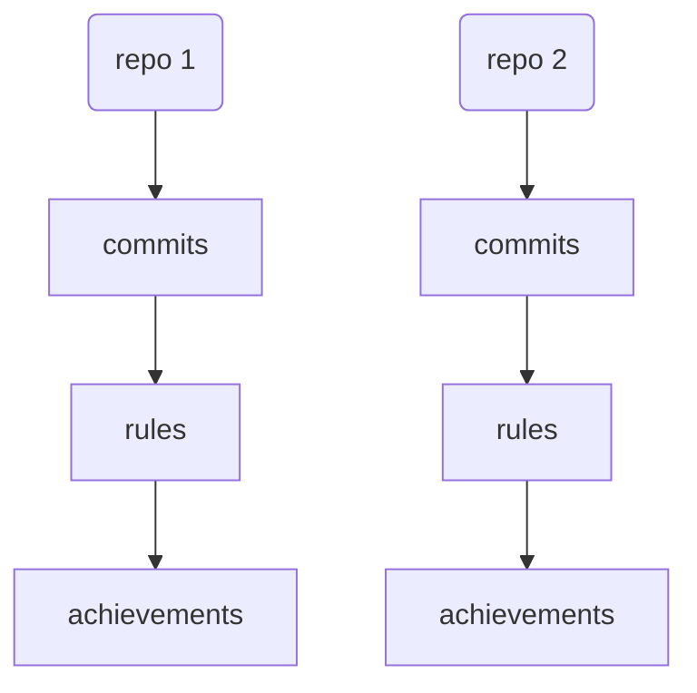
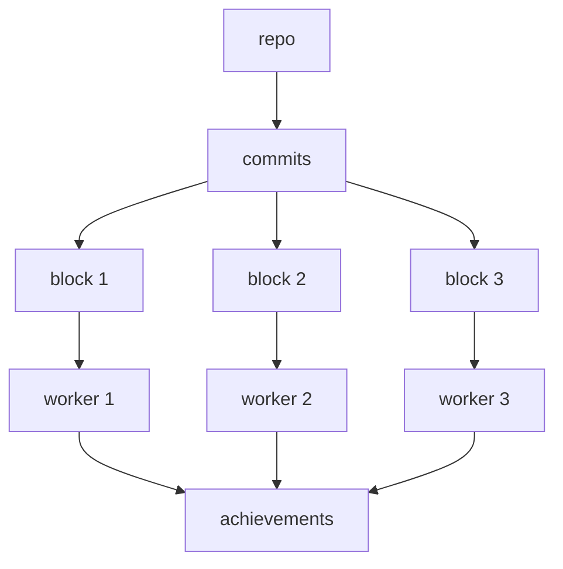
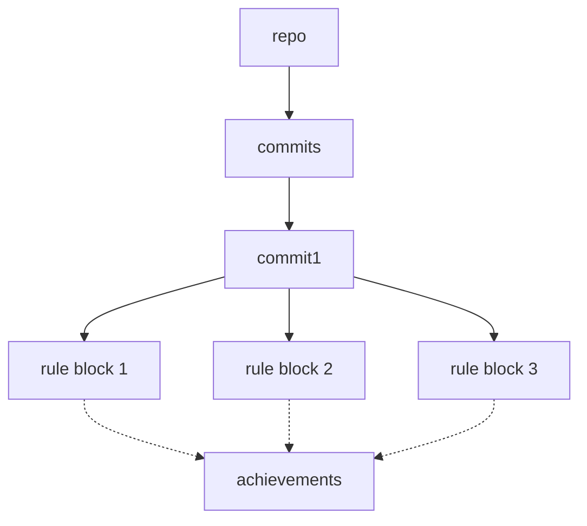

# Parallelism
**Status:** In consideration

One of my complains with <https://github.com/someteam/acha> is how slow and resource heavy it is.
And also that it's unmaintained and difficult to get running.

In _theory_ it shouldn't be expensive to process all of the commits on a given branch (typically the
repository's default branch), especially if there's a cache to prevent unnecessary re-processing.

This problem is embarassingly parallel though, so in addition to an efficient implementation,
parallelism should also be a good way to speed it up.

However, there are several approaches to parallelism, and the right choice depends on ???

## Repository level parallelism
Each repository is processed in serial, but multiple repositories can be processed at once.

**con:** The CLI tool I'm thinking of building would only process a single repository at once. The
parallelism would be limited to the consuming integration layer.

## Split the commits on the default branch into batches
**con:** Nondeterministic results if I care about which commit triggers an achievement. Although
maybe every achievement has levels, and it's okay to have multiple instances.

**con:** Requires loading all commits into memory, so that they can be chunked into blocks? Or is it
cheap enough to traverse the git graph that we can do that in parallel too?

## Process the commits serially, but the rules in parallel
**con:** Processing a slow rule could block progress for the other workers. Mitigation could be to
order the rules by their cost, and try to ensure that each worker has an even load.

## The approach to use

I think I'll start by doing things in serial (repository level parallelism) so see if processing the
rules is too expensive (after caching).

However, in the future, it'd be cool to use NLP techniques for some of the rules, to do, say, NER or
sentiment analysis, or even to use a LLM backend. This could get quite expensive.
