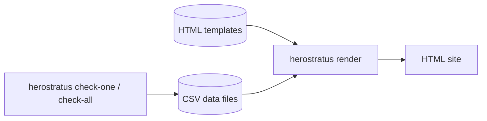
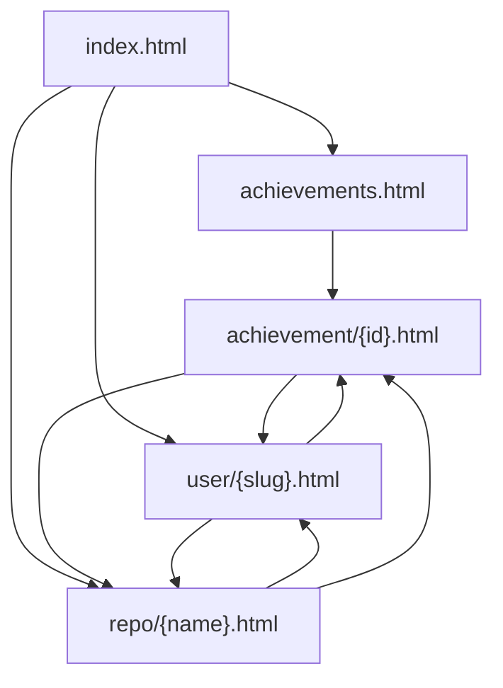

# Static site

# Status

**PROPOSAL**

# Scope

This document covers the design of a static website generated by Herostratus to display achievement
data. It answers:

* What pages does the site have, and what does each page show?
* What data files does Herostratus export for the site?
* How does the rendering pipeline work?
* What technologies are used?

This document does not cover page layout, visual styling, or achievement icons.

# Background

Herostratus's primary use-case is running in CI/CD pipelines. When a repository is merged to its
main branch, a CI job runs Herostratus to check for new achievements. The results should be
presentable as a static website hosted on GitHub Pages or GitLab Pages.

See [integrations.md](integrations.md) for the broader integration design and the CI/CD deployment
pipeline diagram.

The existing achievement log (`achievements.csv`) persists grant/revoke events per-repository. This
design extends that with an export format suitable for cross-repository aggregation and site
generation.

# Proposal

## Architecture: static HTML with progressive enhancement

The site is generated as plain HTML files with CSS. No JavaScript is required for the site to
function. Small vanilla JS scripts provide optional progressive enhancements (table sorting, list
filtering) for browsers that support it.

Alternatives considered: a JavaScript SPA loading JSON data files, and a hybrid approach with
embedded JSON. See the "Alternatives considered" section.

## Two-step pipeline

Data export and HTML rendering are separate steps:



`herostratus check-one` (or `check-all`) writes structured CSV data files. `herostratus render`
reads those files and generates the HTML site. This separation means the data export is reusable for
other integrations, and the site renderer is just one consumer.

In CI:

```bash
herostratus check-one my-project --data-dir ./data/
herostratus render --data-dir ./data/export/ --output-dir ./site/ \
    --base-url /herostratus/ --site-title "My Achievements" \
    --templates ./templates/
```

## Data files

CSV is preferred over JSON because it is append-friendly and produces clean git diffs when committed
back to the integration repository.

```
data/
  cache/                          -- internal state (JSON, not for external consumption)
    checkpoint.json
    {repo-name}/
      rule_foo.json
  export/                         -- publicly exported data (stable-ish contract)
    achievements.csv              -- achievement catalog
    repositories.csv              -- tracked repo metadata
    events/
      {repo-name}.csv             -- per-repo achievement events
```

`check-one` / `check-all` read and write all files. `render` only reads from `export/`. The `cache/`
directory holds internal state (checkpoints, per-rule caches) that the renderer does not need.

The `events/{repo-name}.csv` files are the same files owned by `AchievementLog` - not a separate
export. `check-one` reads them to know what has already been granted, appends new events, and
`render` reads them to build the site.

### achievements.csv

The catalog of all possible achievements. Rewritten on each run from compiled-in `Meta` data.
Changes only when Herostratus is updated with new rules.

| Column        | Type   | Description                                                         |
| ------------- | ------ | ------------------------------------------------------------------- |
| `id`          | int    | Numeric ID (e.g., 1 for H001)                                       |
| `human_id`    | string | Stable string identifier (e.g., "fixup")                            |
| `name`        | string | Display name (e.g., "Leftovers")                                    |
| `description` | string | Short flavor text                                                   |
| `kind`        | string | One of: "per-user", "per-user-repeat", "global", "global-revocable" |

### repositories.csv

One row per tracked repository. `check-one` upserts its row (updates if the repo already exists,
appends if new). This file is small (one row per repo), so read-modify-write is acceptable.

| Column              | Type     | Description                                               |
| ------------------- | -------- | --------------------------------------------------------- |
| `name`              | string   | Repository name (unique, used as slug)                    |
| `url`               | string   | URL to the repository                                     |
| `commit_url_prefix` | string   | Optional URL prefix for linking commits (from RepoConfig) |
| `ref`               | string   | Git ref checked (e.g., refs/heads/main)                   |
| `commits_checked`   | int      | Total commits processed                                   |
| `last_checked`      | datetime | Timestamp of last run                                     |

The `commit_url_prefix` is an optional field provided by the Herostratus `RepoConfig` and passed
through to the data files so the renderer can link commit hashes without any forge-detection logic.
When present, the renderer constructs commit links by appending the hash to the prefix (e.g.,
`https://github.com/owner/repo/commit/` + `abc123`). When empty, commit hashes are rendered as plain
text without links. Populating this field from the clone URL is handled by the config/check layer
and is out of scope for this document; see
[GitHub issue #156](https://github.com/Notgnoshi/herostratus/issues/156).

### events/{repo-name}.csv

Per-repository achievement events. `check-one` / `check-all` append new rows. This is the
append-only core of the data model. Each file is named after the repository (repo names are unique
by Herostratus config constraint).

| Column           | Type     | Description                                |
| ---------------- | -------- | ------------------------------------------ |
| `timestamp`      | datetime | When the event was recorded                |
| `event`          | string   | "grant" or "revoke"                        |
| `achievement_id` | string   | The `human_id` of the achievement          |
| `commit`         | string   | Full commit hash (empty if not applicable) |
| `user_name`      | string   | Display name (mailmap-resolved)            |
| `user_email`     | string   | Email (mailmap-resolved, unique ID)        |

The `commit` column is empty for achievements not associated with a specific commit (e.g., a "most
achievements" leaderboard achievement). The `user_name` and `user_email` columns identify the person
who earned the achievement - this is usually the commit author, but may be the committer for rules
that care about committer identity.

Users are not stored in a separate file. The renderer derives the user list from the events (unique
`user_email` values, using the most recent `user_name` for each).

## Pages

### Page inventory

| Page                | URL path                      | Purpose                               |
| ------------------- | ----------------------------- | ------------------------------------- |
| Landing page        | `index.html`                  | Overview, entry point                 |
| Achievement catalog | `achievements.html`           | All possible achievements             |
| Achievement detail  | `achievement/{human_id}.html` | One achievement's holders and history |
| Repository page     | `repo/{repo-name}.html`       | One repo's achievement activity       |
| User page           | `user/{user-slug}.html`       | One user's achievements across repos  |

### Landing page (index.html)

* Site title and branding, link back to Herostratus
* **Repositories table** - all tracked repos
  * Columns: name, total achievements granted, number of contributors, last activity
  * Each name links to the repository page
* **Recent activity** - last N achievement events across all repos
  * Columns: timestamp, achievement name, user, repo, commit
  * Achievement links to achievement detail, user links to user page, repo links to repo page
* **Leaderboard** - top users by total active achievements
  * Each user links to their user page
* Link to the achievement catalog

### Achievement catalog (achievements.html)

* Table of all possible achievements
  * Columns: ID, name, description, kind, number of current holders
  * Each row links to the achievement detail page
* Can be filtered/sorted with progressive JS enhancement

### Achievement detail (achievement/{human_id}.html)

* Achievement name, ID, description, kind
* **Current holders:**
  * Per-user achievements: list of all users who have it
  * Global achievements: the single current holder
* **History** - timeline of all grants/revokes for this achievement across all repos
* **Stats** - total grants, total unique holders, rarity (% of users who have it)

### Repository page (repo/{repo-name}.html)

* Repository name, link to the actual repo URL
* Summary stats: total commits checked, total achievements granted, unique achievers
* **Achievement timeline** - chronological events for this repo
  * Columns: timestamp, grant/revoke, achievement name, user, commit hash
  * If `commit_url_prefix` is set, commit hash links to the forge; otherwise plain text
  * User links to user page, achievement links to achievement detail
* **Leaderboard** - top achievers in this repo
* **Achievement summary** - which achievements have been granted, how many times

### User page (user/{user-slug}.html)

* User display name (email is the internal unique ID, but not prominently displayed)
* Summary stats: total achievements, active achievements, repos contributed to
* **Achievement showcase** - currently-held achievements grouped by repo
  * Achievement name, description, repo, date granted, commit
* **Timeline** - chronological history of all their grants and revokes

### Link structure

All pages cross-link: repo pages link to users and achievements, user pages link to repos and
achievements, achievement pages link to users and repos.



## URL slugs

* **Repository slugs**: the repository name, which is unique by Herostratus config constraint.
* **User slugs**: derived from the display name by lowercasing and replacing non-alphanumeric
  characters with hyphens. On collision (two users with the same slugified name), append a numeric
  suffix (`alice-smith`, `alice-smith-2`). The mapping is deterministic: sort users by their
  earliest event timestamp across all event files, and the first-seen user gets the bare slug. This
  ensures that existing slugs remain stable as new users appear.
* **Achievement slugs**: the `human_id` field (e.g., "fixup", "shortest-subject-line"). Already
  unique and URL-safe.

## Rendering

### Template engine

Use [minijinja](https://docs.rs/minijinja) for HTML template rendering. Templates use Jinja2 syntax
and are loaded from a directory provided via the `--templates` flag. Default templates are embedded
in the binary (via `include_str!`) and used when `--templates` is not specified, but the flag allows
users to provide fully custom templates.

### Output structure

```
site/
  index.html
  achievements.html
  achievement/
    fixup.html
    shortest-subject-line.html
    ...
  repo/
    my-project.html
    another-repo.html
  user/
    alice-smith.html
    bob-jones.html
  assets/
    style.css
    sort-table.js
    filter-list.js
```

### Progressive JS enhancements

Small vanilla JavaScript files (no framework, no npm, no build step) provide optional interactivity.
The site is fully functional without them.

Planned enhancements:

* **Table sorting** - click column headers to sort. Without JS, tables are in chronological order.
* **List filtering** - type to filter a list of users or achievements. Without JS, the full list is
  shown.
* **Relative timestamps** - display "3 days ago" alongside absolute timestamps.

### Customization

The `render` subcommand accepts flags for user customization:

* `--site-title text` - site title shown in the header and `<title>` tags (default: "Herostratus")
* `--base-url url` - base URL prefix for all internal links and asset references (default: `/`).
  Required when the site is hosted at a subpath (e.g., `https://user.github.io/herostratus/`).
  Templates prefix all `href` and `src` attributes with this value.
* `--custom-css path` - additional CSS file to include
* `--custom-header path` - HTML fragment to inject into the page header
* `--custom-footer path` - HTML fragment to inject into the page footer
* `--templates path` - Path to the runtime directory containing the necessary jinja2 templates

Templates include conditional blocks for these injections.

## Renderer pipeline

```
1. Load export/achievements.csv                   (achievement catalog)
2. Load export/repositories.csv                   (repo list + metadata)
3. For each repo: load export/events/{name}.csv   (all events)
4. Derive user list from events                   (unique emails, latest-timestamp name per email)
5. Generate slug mappings                         (user slugs, first-seen timestamp breaks ties)
6. Aggregate cross-cutting data                   (per-user stats, per-achievement stats, leaderboards)
7. Render all HTML pages via minijinja
8. Copy static assets (CSS, JS) to output
```

# Alternatives considered

## JavaScript SPA loading JSON data files

Herostratus would export JSON files and a vanilla JS application would fetch and render them
client-side. This provides clean data/presentation separation and makes it easy to iterate on the UI
without recompiling Rust. However, it requires writing and maintaining JavaScript, introduces
complexity (CORS during local development, fetch error handling, loading states), and is harder to
reason about for a team that primarily works in Rust. The dataset is small enough that the
advantages of client-side rendering (shared data, dynamic filtering) do not outweigh the simplicity
of pre-rendered HTML.

## Hybrid: static HTML with embedded JSON

Generate HTML pages with data embedded as `<script type="application/json">` blocks. Pages render as
static HTML but JS can enhance them. This is the most complex option to build and maintain, and the
progressive enhancement approach achieves a similar result with less complexity.

## JSON instead of CSV for data files

JSON is more expressive (nested structures, typed values) but does not diff well in git and is not
append-friendly. Since the primary use-case is CI pipelines committing data back to a repository,
CSV's line-oriented format produces cleaner diffs and supports simple append operations without
parsing the existing file.

# Open questions

* Achievement icons: should they be SVGs shipped with Herostratus, or configurable? How are they
  generated?
* How should the renderer handle events for achievements that are no longer in the catalog (removed
  rules)?

# References

* [GitHub issue #104](https://github.com/Notgnoshi/herostratus/issues/104)
* [integrations.md](integrations.md) - broader integration design
* [data-model.md](data-model.md) - achievement data model
* [persistence.md](persistence.md) - persistence design
